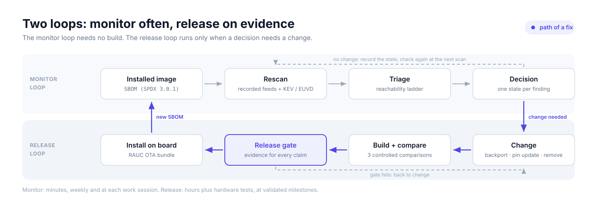

# ADR-0013: Vulnerability handling — two loops, milestone releases, evidence-based acceptance

- Status: Accepted
- Date: 2026-10-06

## Context

Every build produces an SPDX 3.0.1 SBOM and a CVE report
([`vuln-mgmt-architecture.md`](../security/vuln-mgmt-architecture.md)). The report lists
thousands of rows. Most of them are kernel rows: the Linux kernel CVE team assigns a CVE to
almost every bug fix and leaves applicability to each user
(`Documentation/process/cve.rst`). CVSS scores describe the worst reasonable deployment,
not this image.

A rebuild is expensive. Changing a library such as glibc or Python rebuilds most of the
image, and a release needs hardware tests on each board. The project has one maintainer.

The EU Cyber Resilience Act (Regulation (EU) 2024/2847) is a design reference. It asks
that products ship without known exploitable vulnerabilities, that vulnerabilities are
handled without delay, and that actively exploited vulnerabilities are reported (an early
warning within 24 hours, a notification within 72 hours, and a final report within 14 days
after a corrective or mitigating measure is available). Reporting obligations apply from
11 September 2026 and the main obligations from 11 December 2027. This project is a
reference implementation; this record does not decide CRA applicability.

`vuln-mgmt-architecture.md` already decides how findings are triaged and recorded (D1–D7:
human-sized worklists, suppressions in version control, truthful states, no unreviewed
automated suppression, a second scanner, a separate kernel method, reproducible inputs).
This record decides **when** work runs and **what an image needs before it ships**.

## Decision

1. **Two loops.** A *monitor* loop scans the SBOM of the installed image and of the newest
   validated image against current CVE feeds and exploitation signals, and triages the
   result. It needs no build. A *release* loop changes, builds, compares, passes the
   release gate and installs. The release loop runs only when a monitor decision needs a
   change, or at a validated milestone.
2. **Milestone releases, no calendar and no response-time commitment.** Releases happen at
   validated milestones. The process records the time from discovery to assessment, to
   mitigation and to installed fix, and treats those times as measurements, not promises.
3. **Acceptance by evidence, not by count.** An image is accepted against the release gate
   in [`VULN-HANDLING.md`](../security/VULN-HANDLING.md#9-release-gate): every claimed
   fix and every not-affected state has evidence for this image, every finding has a
   state, and the change against the previous release is explained in both directions.
   A validated image does not ship with an exploited, reachable finding unless the
   affected function is disabled or removed in that image.
4. **Only build-time evidence suppresses.** A finding is not affected only when the
   component or the vulnerable code is absent from the build (reachability ladder steps 1
   and 2 in `VULN-HANDLING.md`). Runtime evidence (steps 3 and 4, answered for every
   attacker class in scope) makes a finding *not reachable*: it stays open with the lowest
   priority and a machine-checkable trigger. A mitigation never suppresses a finding.
5. **Pin updates over accumulated backports.** A backport is used when a fix is urgent,
   small and understood. When fixes need prerequisites or adaptation, or when carried
   backports accumulate, the vendor branch, stable release or layer pin is updated
   instead. Carried backports are reviewed at each milestone.

## Alternatives considered

- **Rebuild for every new finding.** Rejected: the build and hardware-test cost is paid for
  findings that are often not reachable, and frequent partial releases are harder to
  verify than a reviewed batch.
- **Fixed release calendar (for example monthly).** Rejected: a calendar forces builds when
  nothing reachable changed and does not speed up an exploited finding, which goes first in
  any case.
- **Release gate on a CVE count or a CVSS threshold.** Rejected: a count falls with wrong
  suppressions as well as with fixes, and CVSS does not describe this image. Both reward
  a better number instead of better evidence.
- **Suppress runtime-gated findings as `not-applicable-config`.** Rejected: the exported VEX
  justification (`vulnerableCodeNotPresent`) states that the code is absent while it is
  present, and a runtime property (a service not installed, a sysctl) can change after
  release without anyone re-checking the suppression.
- **Response-time commitments (SLAs).** Rejected for this reference implementation: one
  maintainer cannot honour them reliably, and an unreliable promise is worse than a
  recorded measurement. A product built on this platform sets its own.

## Consequences

- Builds concentrate at milestones. Between milestones, exposure is tracked by the monitor
  loop, and an exploited finding is contained on running boards until its fix is
  installed.
- A device runs the image it was given. A fix in a later image does not protect it until
  that image is installed; the monitor loop therefore scans what is installed, not only
  what is built.
- Every not-affected state carries ladder evidence and an invalidation condition, which
  makes triage slower per finding and the exported VEX more trustworthy.
- Report intake, coordinated disclosure and response-time commitments stay outside this
  process ([`CRA-CONTROLS.md`](../security/CRA-CONTROLS.md), Part II).
- Procedures, terms, the state mapping and the release gate are maintained in
  [`VULN-HANDLING.md`](../security/VULN-HANDLING.md); this record changes only when a
  decision above changes.
