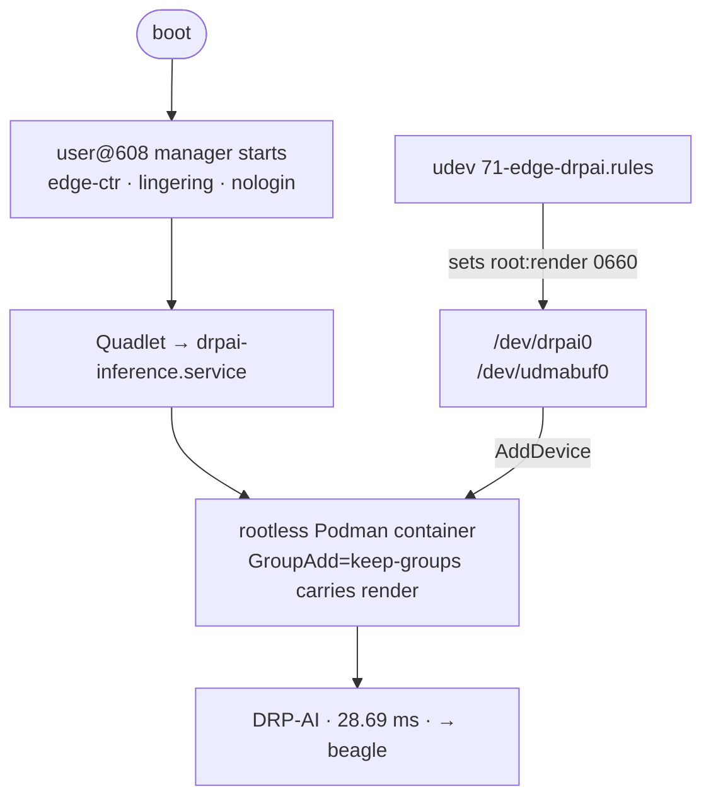

# DRP-AI on EDGE AI OS

**Container-native inference on the Renesas RZ/V2L accelerator.**

A ResNet-18 classifier auto-starts at boot inside a **rootless Podman container**,
executes on the **DRP-AI** accelerator in **~28 ms**, and never touches an interactive
login or a graphical session — on a hardened, RAUC A/B, OTA-updatable platform.

<picture>
  <source media="(prefers-color-scheme: dark)" srcset="diagrams/rzv2l-drpai-pipeline.dark.svg">
  
</picture>

> **Why this exists.** The vendor's reference path for DRP-AI is a Weston/GUI demo, run
> as **root**, on a vendor BSP image — fine for a first look at the silicon, not what
> you ship. This is the other half: the accelerator as a **maintained, least-privilege
> service** on a platform built for long-lived edge devices.

## At a glance

| | |
|---|---|
| **Demonstrates** | ResNet-18 classifier · **~28 ms** on the accelerator (vs. seconds on CPU) |
| **Runs as** | rootless Podman container → systemd Quadlet → dedicated `nologin` principal (`edge-ctr`) |
| **Privilege** | no root, no `--privileged` — device access by `render`-group membership |
| **Boot** | auto-starts, zero manual steps, survives OTA slot switches |
| **Kernel** | linux-cip 6.12 (CIP Super-LTS, [ADR-0001](../adr/0001-kernel-base.md)) |
| **Status** | validated on hardware under **permissive** SELinux — [details](#status--roadmap) |

**What you need to reproduce it** — the split that shapes the whole integration:

| | Components | How you get them |
|---|---|---|
| **Public — in-tree recipes** | DRP-AI driver · TVM/MERA runtime · `u-dma-buf` · mmngr · the inference app | fetched from public sources, pinned by commit — nothing to obtain |
| **Vendor — host-only** | AI SDK: model compiler / translator · cross-SDK | free download from the Renesas portal; used on the build host, never shipped |

A compiled model is *produced with* the vendor host tools, but the artifact and the
on-device runtime that runs it are the public, redistributable pieces.

## Architecture — how the pieces fit

Four things live on the device: a **driver** exposing the accelerator, a **buffer
path** to feed it, a **runtime** to load compiled models, and an **app** to tie it
together.

- **Driver** — the DRP-AI chardev (`/dev/drpai0`), forward-ported to linux-cip 6.12.
  Source: **[umair-as/rzv2l-drpai-driver](https://github.com/umair-as/rzv2l-drpai-driver)**,
  fetched by `kernel-module-drpai`. *How the port was done → [port-notes.md](port-notes.md).*
- **Runtime + app** — `drpai-tvm-runtime` (Renesas' Apache-2.0 MERA/TVM libraries)
  executes compiled models; `drpai-tvm-app` is the sample classifier, built as a
  bitbake recipe so its ABI matches the rootfs. *Packaging details →
  [integration-notes.md](integration-notes.md).*
- **Buffers** — the driver is a control plane, **not** a buffer engine; the tensors
  live in three reserved DDR regions (`drp_reserved` 512 MiB, `image_buf`/udmabuf
  64 MiB, mmngr 128 MiB). *Deep dive → [integration-notes.md](integration-notes.md).*

### Container-native identity

This is where the integration diverges from the reference flow, and where the design
value sits. Instead of the app running as root in a desktop session, the workload is a
**rootless Podman container**, declared as a **systemd Quadlet**, under a **dedicated,
non-interactive service principal `edge-ctr`**:

- **`nologin`** — exists only to run containers; not a login surface
- **Pinned UID/GID** — the same principal across every build and device (audit-ready)
- **Own `subuid`/`subgid`** — deterministic, isolated rootless namespace mapping
- **Linger by design** — its systemd user instance (and its containers) exist without
  anyone logging in
- **State on `/data`** — home and container storage survive OTA slot switches
  ([ADR-0004](../adr/0004-persistent-state-architecture.md))
- **`render`-group member** — earns accelerator-node access with no elevation

Device passthrough carries `/dev/drpai0` + `/dev/udmabuf0` into the unprivileged
container with `GroupAdd=keep-groups` — no `--privileged`, no root. The whole boot
chain, no interactive login anywhere in it:

*The boot-ordering fix that makes the lingered manager reliable → [integration-notes.md](integration-notes.md).*

## Proof it's the accelerator

Two independent witnesses show it's the silicon, not a CPU fallback dressed up as one:

1. **Latency** — the same network on CPU alone is on the order of *seconds*; ~28 ms is
   two orders of magnitude faster. Only the hardware path reaches it.
2. **The interrupt counter** — the DRP-AI block's AI-MAC completion counter in
   `/proc/interrupts` advances a fixed amount **per inference run** and stays put when
   nothing runs. Software can't move that counter; only the silicon raising the IRQ can.

Both hold **through the container** — the rootless run produces the same timing and the
same interrupt activity as a native run.

## Board-agnostic by construction

The whole stack is gated behind one feature switch and a machine guard. DRP-AI is
RZ/V2L-specific SoC IP, but the *structure* around it — a feature-gated accelerator
packagegroup, a dedicated rootless principal, a Quadlet workload, device passthrough by
group membership — is not Renesas-specific. **The accelerator is the changeable part;
the container-native, least-privilege, OTA-aware delivery is the durable part.**

## Reproduce & evaluate

- **Build it** — enable `EDGE_ENABLE_AI` and build the image for `smarc-rzv2l`; flash
  it and the classifier auto-runs at boot (no manual steps).
- **Compile your own model** → [compiling-models.md](compiling-models.md) — the
  host-side container flow (ONNX → DRP-AI artifact).
- **Measure any model on the NPU** → [benchmarking-models.md](benchmarking-models.md) —
  the `drpai-runner` benchmark, latency + NPU-vs-CPU split.
- **Go deeper** → [port-notes.md](port-notes.md) (driver port) ·
  [integration-notes.md](integration-notes.md) (runtime, buffers, lifecycle) ·
  [ADRs](../adr/).

## Status & roadmap

Stated honestly — the value of these docs depends on it.

**✅ Validated on hardware (permissive SELinux)** — driver builds and binds on
linux-cip 6.12 (`/dev/drpai0` present, accelerator confirmed via the interrupt
witness); runtime + app run natively and rootless; all three buffer regions in use;
rootless inference auto-starts at boot under the dedicated principal, end-to-end.

**⏭ Next, not done** — **SELinux enforcing** (needs a device-label policy for the
accelerator nodes; the immediate next step, not claimed as achieved); **clean-build
validation** of the boot-ordering fix (validated as deployed, not yet from a fresh full
image build).

**🧭 Roadmap** — a reproducible model-compile environment; a baked, trust-pinned
container base image; a self-seeding on-`/data` model payload for a self-contained
fresh device.

---

*This document describes method and architecture. It contains no vendor proprietary
material; the AI SDK, model translator, and GPU/codec libraries are obtained separately
under Renesas' own terms and are not part of this project.*
