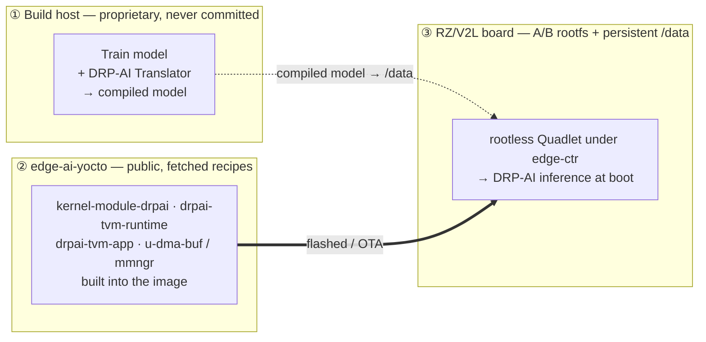
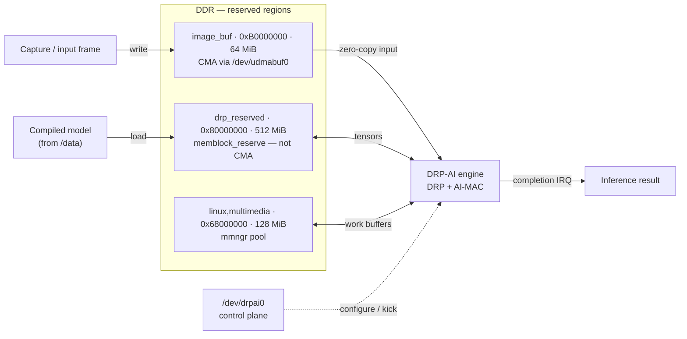
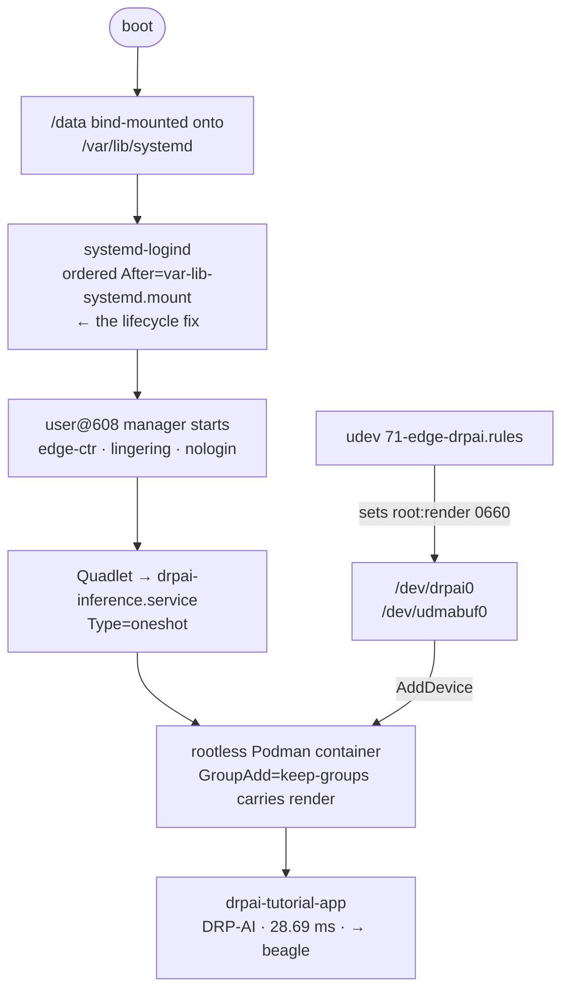

# DRP-AI on edge-ai-yocto — a container-native integration

This document describes how the Renesas RZ/V2L **DRP-AI** inference
accelerator is integrated into edge-ai-yocto, and — more importantly —
*why* the integration is shaped the way it is.

The short version: DRP-AI runs here as a **rootless, headless,
container-native** workload on a hardened, OTA-updatable, A/B-slotted
platform. A ResNet-18 classifier auto-starts at boot inside a rootless
Podman container under a dedicated service principal, executes on the
accelerator in ~28 ms, and never touches an interactive login or a
graphical session. That "headless" describes the *workload*, not the
board — the platform runs Weston on HDMI and drives a MIPI camera; the
inference service is deliberately decoupled from any display or login.

That framing is the point. The vendor's own reference path for DRP-AI
is a Weston/GUI demo, run as root, on a vendor BSP image. Useful for a
first look at the silicon; not what you ship. The work documented here
is the *other* half — taking the accelerator from "runs in a demo" to
"runs as a maintained, least-privilege service on a platform built for
long-lived edge devices." Each section below is a decision that fell
out of that goal.

> **Status (read this first).** The end-to-end path described here is
> validated on hardware under **permissive** SELinux. Moving to
> **enforcing** (with a device-label policy for the accelerator nodes)
> is the next step, not a completed one. A few other items are
> explicitly roadmap, not accomplishment — see
> [Status and roadmap](#status-and-roadmap) at the end. Where something
> is proven, this document says how it was proven; where it isn't, it
> says so.

---

## At a glance

The boundary that shapes everything below: model *compilation* uses
proprietary host tools and never enters this repository; everything
*shipped* — driver, runtime, app, buffer providers — is public and
fetched, and meets the compiled model only on the device.

---

## 1. The problem, and what it was *not*

DRP-AI is the DRP (Dynamically Reconfigurable Processor) + AI-MAC
matrix-multiply block on the RZ/V2L. Getting a model onto it needs four
things on the device: a **kernel driver** exposing the accelerator, a
**buffer path** to feed it, a **userspace runtime** to load compiled
models and drive the hardware, and an **application** to tie it
together. Renesas ships all of this, but assembled around a vendor BSP
and a desktop-style demo.

edge-ai-yocto targets the opposite end: a kernel base chosen for a
~10-year maintenance horizon (CIP Super-LTS, see
[ADR-0001](../adr/0001-kernel-base.md)), read-from-`/data` persistent
state, RAUC A/B updates, and a container runtime as the unit of
deployment. The integration had to land DRP-AI *into that*, not bolt a
demo on the side.

The first surprise was a pleasant one: the hard part was smaller than
it looked.

---

## 2. The driver forward-port (6.1 → 6.12), and why it was small

The DRP-AI kernel driver is written against the vendor's verified Linux
package, which tracks **kernel 6.1**. edge-ai-yocto runs **linux-cip
6.12** (the CIP SLTS branch the platform standardises on). A driver
written for 6.1 and dropped onto 6.12 does not compile. The question
was how deep the gap went.

It *looked* deep. DRP-AI moves large tensors; a naive reading says a
6.1→6.12 forward-port means chasing the dma-buf / DMA-API churn across
four kernel releases — a real rewrite. That reading is wrong, and
understanding why is the key insight of the whole driver effort:

> **The DRP-AI driver is a control-plane character device, not a
> buffer engine.** It is an ioctl chardev (`/dev/drpai0`) that
> configures the accelerator, kicks off inference, and reports
> completion. It does **not** own the bulk data path — there is no
> `mmap` of model tensors through the driver. The heavy buffers come
> from *other* providers (see [§5, Buffer architecture](#5-buffer-architecture-three-regions-one-reason-each)).
> So the dma-buf churn that dominates other drivers' forward-ports
> simply isn't in this one's surface.

What was left was ordinary API drift — five small fixes,
version-guarded where the change is version-specific:

- `class_create()` dropped its `owner` argument (6.4).
- `DEFINE_SEMAPHORE()` gained a count argument (6.4).
- `platform_driver`'s `.remove` callback became `void`-returning (6.11).
- `<linux/vmalloc.h>` stopped being transitively included.
- A `const static` → `static const` ordering nit the newer compiler rejects.

The four API changes are each a couple of lines, guarded by
`LINUX_VERSION_CODE` so the same source still builds against 6.1; the
`const`-ordering nit is unconditional. None of it touches the
accelerator logic.

### The one real wall

There was exactly one substantive blocker, and it is worth calling out
because it explains a vendor decision:

The driver performs cache maintenance on the accelerator's buffers
using the arm64 point-of-coherency helpers `dcache_clean_inval_poc()`
and `dcache_inval_poc()`. On 6.12 these symbols are **not exported** to
modules. An in-tree driver can call them freely; an out-of-tree module
cannot — `modpost` fails with undefined symbols. *This* is why the
vendor ships DRP-AI in-tree: in-tree code sidesteps the export
boundary.

We keep the driver out-of-tree (for reasons in [§3](#3-driver-provenance-fetched-not-vendored)),
so the fix is a **two-line kernel patch** exporting those two symbols
(`EXPORT_SYMBOL_GPL`), carried as a board patch alongside the
device-tree work. That patch — not the API drift — was the actual cost
of the forward-port. Naming it precisely matters: it is the difference
between "port the driver" (small) and "rewrite the buffer path"
(imagined, never needed).

The device-tree side adds the `renesas,rzv2l-drpai` node (register
banks, the DRP-AI clocks, reset, and the four completion interrupts) so
the driver has something to bind. Those interrupts reappear in
[§6](#6-the-verified-result-and-how-we-know-its-the-accelerator) as the
hardware witness that the accelerator actually ran.

---

## 3. Driver provenance: fetched, not vendored

The DRP-AI driver source is **GPL-2.0**, distributed by Renesas in an
open-source package — but with no upstream git repository for the V2L
driver to track. That left a provenance choice.

The decision: **repackage the GPL driver as a standalone, public git
repository, and have the Yocto recipe *fetch* it — not vendor a copy
into this tree.** The recipe (`kernel-module-drpai`) is an out-of-tree
kernel module that pins the driver repo by commit via a `git://`
`SRC_URI`.

Why fetched-not-vendored:

- **The driver is its own upstream.** Treating it as a pinned external
  dependency keeps its history, licence, and provenance self-contained
  and auditable, instead of melting a GPL drop into the platform tree.
- **The export patch stays a kernel patch.** The two-line cache-op
  export belongs to the *kernel*, carried in the kernel recipe — not
  smuggled into the driver source. Keeping the driver pristine and the
  patch visible is honest about what was changed and where.
- **Clean SBOM/CVE story.** A pinned external module with a known
  licence and origin is a first-class line in the software bill of
  materials, not an unattributed blob.

### The public/private boundary

This is the rule the whole integration respects, and it is worth
stating plainly for anyone building on it:

- **Public, and in-tree as recipes:** the GPL DRP-AI driver, the
  Apache-2.0 TVM/MERA runtime (below), the BSD-licensed `u-dma-buf`
  provider, the MIT/GPL memory-manager modules. All fetched from public
  sources, pinned by commit.
- **Proprietary, and never committed:** the vendor AI SDK, the model
  *compiler/translator*, and the GPU/codec libraries are obtained from
  the vendor's portal under their own licence. They are build-host
  tools or optional runtime components — they do not appear in this
  repository, in recipes, or in published artifacts.

Concretely: a compiled model is produced *with* proprietary host tools,
but the model artifact and the on-device runtime that executes it are
the public, redistributable pieces. The boundary runs between "tools
used to build" and "things we ship." The build side — the host
container that turns a model into a DRP-AI artifact, and where that
proprietary line sits — is documented in
[Compiling models for DRP-AI](compiling-models.md).

---

## 4. The runtime layer

A compiled DRP-AI model is executed on-device by the **DRP-AI TVM /
MERA runtime** — a set of shared libraries from Renesas' Apache-2.0
runtime project. edge-ai-yocto packages these as `drpai-tvm-runtime`.

Three decisions shaped that recipe.

### "v2m runtime for V2L"

The upstream runtime project ships prebuilt runtime libraries per SoC.
There is **no separate V2L build** — V2L consumes the **v2m** runtime
(the upstream build system selects v2m for the V2L/V2M/V2MA family).
This is non-obvious and easy to get wrong; the recipe documents it so
the next person doesn't go looking for a "v2l" artifact that was never
produced. The prebuilt libraries require only an old glibc floor, so
they load cleanly on the platform's current toolchain rootfs.

### `-dev` packaging so applications can build against it

The prebuilt runtime repository is **library-only** — it ships `.so`
files but not the headers needed to *compile* against them. Those
headers (the TVM runtime API, plus a small set of vendor-patched
override headers that match the prebuilt libraries' ABI) live in a
pinned source tree the runtime references.

`drpai-tvm-runtime` therefore sources those headers at their pinned
revision and ships a proper **`-dev` package**: install the runtime,
and any application recipe can `#include` the runtime API straight from
the sysroot. The unversioned `.so` sonames are routed into the main
(runtime) package rather than the `-dev` package — the standard
prebuilt-library packaging idiom — so the libraries ship on the device
and the headers ship to the SDK/sysroot, cleanly separated.

This turns a "copy the libs and hope" situation into a recipe that is
*self-describing*: the thing that provides the runtime also provides
exactly what you need to build against it.

### The application is a Yocto recipe, not an SDK exercise

The sample classifier (`drpai-tvm-app`) is built as a **bitbake
recipe**, depending on `drpai-tvm-runtime` (for the runtime `-dev`
headers and the libraries) and the driver's UAPI header.

The alternative — generate an SDK, install it, cross-compile the app by
hand — works, but building the app *in the build* is strictly better
here: it uses the platform's own cross toolchain against the platform's
own sysroot, so the resulting binary's ABI is **guaranteed** to match
the rootfs it runs on (same libc, same C++ runtime, same kernel UAPI).
No "compiled against a slightly different SDK" class of bug. The SDK
remains available for off-device app development; it is not on the
critical path for shipping the workload.

---

## 5. Buffer architecture: three regions, one reason each

If the driver isn't the buffer engine, where does the memory come from?
DRP-AI inference on this platform uses **three** distinct reserved
memory regions, because three different things are going on with three
different lifetimes and allocators. Conflating them is how you get
silent corruption; separating them is the architecture.

| Region | Address | Size | Kind | Role |
|---|---|---|---|---|
| `drp_reserved` | `0x80000000` | 512 MiB | `memblock_reserve` carveout | Model + inference working set |
| `image_buf` (udmabuf) | `0xb0000000` | 64 MiB | CMA (`shared-dma-pool`) | Zero-copy input frames |
| `linux,multimedia` (mmngr) | `0x68000000` | 128 MiB | Memory-manager pool | Runtime work buffers |

> Note the split the diagram makes explicit: `/dev/drpai0` only
> *configures and triggers* the engine (control plane); the bulk tensors
> never flow through the driver — they live in the three regions above.
> That is why the forward-port was small.

**`drp_reserved` — the accelerator's working set.** A dedicated
`memblock_reserve` carveout, *not* CMA. (A subtlety worth recording:
the device-tree `reusable` keyword is a no-op without a
`shared-dma-pool` compatible — so this region is genuinely reserved,
not reclaimable, despite how the node reads.) The driver reports this
region's base to userspace via an ioctl; the runtime maps its model and
intermediate tensors here. When you see the runtime load at
`0x80000000`, this is the region it landed in.

**`image_buf` / udmabuf — the input path.** A real CMA region exposed
as a dma-buf by the `u-dma-buf` provider (`/dev/udmabuf0`). This is the
zero-copy path for input frames: a capture source writes a frame into
the dma-buf and the accelerator consumes it without a bounce copy. It
is deliberately separate from `drp_reserved` because input frames have
a producer/consumer lifetime independent of the model's working set.

**`linux,multimedia` / mmngr — the managed pool.** The runtime links
the Renesas memory-manager userspace library, which allocates certain
DRP work buffers from this multimedia pool. The valuable detail here:
this region and its device-tree nodes are **already present in the base
SoC device tree** — so adopting it cost *zero* device-tree work. The
kernel modules and userspace libraries for it are open-source and were
simply enabled, not authored.

Three regions, three jobs: compute working set, input frames, managed
work buffers. Each with the allocator that fits its lifetime.

---

## 6. Container-native identity

This is where the integration most diverges from the reference flow,
and where most of the design value sits.

The reference path runs the inference app as **root**, in a desktop
session. On a platform whose deployment unit is a rootless container on
a hardened base, that is the wrong shape twice over: wrong privilege
level, and wrong lifecycle. The workload here runs as a **rootless
Podman container**, declared as a **systemd Quadlet**, under a
**dedicated, non-interactive service principal**.

### Why a dedicated principal, not the interactive login

The platform has an interactive operator login (an SSH user with sudo).
The tempting shortcut is to run containers as that user. It is the
wrong call, for a reason that generalises well beyond DRP-AI:

> **An interactive developer login and a headless service runtime are
> two different trust levels. Conflating them couples the container
> runtime's lifecycle to a human's login session** — which is exactly
> the failure mode that bites you: the container's user-level systemd
> instance only exists while that human is "logged in," so a headless,
> reboot-survivable workload built on it is built on sand.

So edge-ai-yocto defines its own dedicated container principal —
referred to here as **`edge-ctr`** — with these properties, all baked
at build time:

- **No interactive login.** A system account with `nologin`; it exists
  only to run containers. Its credentials are not a login surface.
- **A stable, pinned identity.** Fixed UID/GID from the platform's
  static-ID tables, so the principal is the same across every build and
  every device in a fleet — a prerequisite for any audit story.
- **Subordinate ID ranges for rootless containers.** Its own
  `subuid`/`subgid` block, distinct from the operator's, so the
  rootless user-namespace mapping is deterministic and isolated.
- **Linger by design.** Lingering is enabled declaratively in the
  image, not by a post-boot `loginctl` command. This is what lets the
  principal's systemd user instance — and therefore its containers —
  exist *without anyone logging in*. It fixes the headless-lifecycle
  problem at its root rather than patching around it.
- **State on `/data`.** The principal's home and container storage live
  on the persistent `/data` partition, not on the A/B rootfs — so
  pulled image layers and container state survive an OTA slot switch
  instead of being discarded with the old root filesystem (consistent
  with the platform's persistence model,
  [ADR-0004](../adr/0004-persistent-state-architecture.md)).
- **Accelerator-group membership.** It is a member of the `render`
  group, which is how it earns access to the accelerator device nodes
  (below) without any elevation.

### The Quadlet and device passthrough

The workload is a `.container` Quadlet unit (systemd generates the
service from it). It passes the two accelerator device nodes —
`/dev/drpai0` and `/dev/udmabuf0` — into an otherwise unprivileged
container, and carries the host's `render`-group membership across the
namespace boundary so the in-container process can open those
`0660 root:render` nodes. No `--privileged`, no root, no manual device
allowlisting. The device nodes get their `render`-group ownership from
a udev rule shipped with the stack.

The model and the application binary are bind-mounted in from `/data`,
keeping the large, rarely-changing model payload off the rootfs and on
persistent storage.

### The lifecycle fix

Standing this up surfaced — and fixed — a subtle, platform-wide
ordering bug that is worth documenting because it affects *any*
lingering user, not just the AI principal:

`systemd-logind` scans the linger markers at *its own* startup to
decide which users' managers to start. On this platform those markers
live under `/var/lib/systemd`, which is **bind-mounted from `/data`**.
logind was winning the race against that mount — scanning an empty
directory before `/data` was bound — and so it started **no** lingering
users' managers at boot. The symptom is the classic "rootless service
works after I log in, but not at boot."

The fix is a one-line ordering directive: logind is ordered **after**
the `/var/lib/systemd` bind mount, so the markers are present when it
scans. With that in place, the principal's user manager comes up at
boot on its own, its Quadlet generates, and the inference runs — with
no human in the loop.

The whole chain — the boot-ordering fix on the left, the
least-privilege device passthrough on the right — converging with no
interactive login anywhere in it:

---

## 7. The verified result, and how we know it's the accelerator

On the validated board, after a clean boot and **zero manual steps**:

- The dedicated principal's systemd user manager is active (lingered).
- Its Quadlet-generated service has run to success.
- The journal shows the classifier's output: ResNet-18 on the sample
  image → top-1 **beagle**, with the rest of the top-5 all hound breeds
  — a correct classification.
- Inference time: **~28 ms**.

That last number is the first half of the proof it's really the
accelerator and not a CPU fallback dressed up as one. The same network
on the CPU alone is on the order of **seconds** (multiple thousands of
milliseconds). ~28 ms is two orders of magnitude faster — only the
hardware path reaches it.

The second half is direct hardware evidence. The DRP-AI block raises
**completion interrupts** to the GIC — the same interrupt lines wired
into the device tree during the driver port. The AI-MAC
normal-completion counter in `/proc/interrupts` advances by a fixed
amount **per inference run** and stays put when nothing runs.
Software on the CPU cannot move that counter; only the silicon raising
the interrupt can. Each inference run advances it by a fixed amount;
when nothing runs, it doesn't move. Combined with the runtime mapping into
the `drp_reserved` region and an `strace` showing the process driving
`/dev/drpai0` directly, there is no ambiguity: the DRP-AI engine
executed the inference.

This holds **through the container** — the in-container, rootless run
produces the same timing and the same interrupt activity as the native
run. Containerisation does not soften the hardware path.

---

## 8. Why this is board-agnostic by construction

The whole stack is gated behind a single feature switch and a
machine-compatibility guard. With the switch off, none of it is in the
image; with it on, it composes in. DRP-AI itself is RZ/V2L-specific
SoC IP, so its recipes are machine-guarded — but the *structure* around
it (a feature-gated accelerator packagegroup, a dedicated rootless
container principal, a Quadlet workload, device passthrough by group
membership) is not Renesas-specific at all. A different accelerator on
a different board slots into the same shape: its driver and runtime
behind the same gate, its device nodes through the same passthrough
model, its workload as another Quadlet under the same principal.

That generality is deliberate. The accelerator is the changeable part;
the container-native, least-privilege, OTA-aware *delivery* is the
durable part.

---

## Status and roadmap

Stated honestly, because the value of these docs depends on it.

**Validated on hardware (permissive SELinux):**
- Driver forward-port — builds and binds on linux-cip 6.12; `/dev/drpai0`
  present; accelerator confirmed live via the interrupt witness.
- Runtime + app recipes — build in-tree; app runs natively, rootless and
  as root.
- Buffer regions — all three present and used; runtime maps into
  `drp_reserved`.
- Container-native path — rootless inference under the dedicated
  principal, auto-starting at boot via the Quadlet, end-to-end.

**Next, not done:**
- **SELinux enforcing.** Everything above is under **permissive**.
  Enforcing requires a device-label policy so the container domain may
  open the accelerator nodes; that policy work — collect the access
  vectors under permissive, build the module, validate via a controlled
  reboot into enforcing — is the immediate next step and is *not*
  claimed as achieved.
- **Clean-build validation of the lifecycle fix.** The logind ordering
  fix is baked into its recipe, but at time of writing it has been
  validated as deployed to a running device, not yet re-validated from a
  fresh full image build. That confirmation is pending.

**Roadmap:**
- **Reproducible model-compile environment.** Compiling a model uses
  proprietary host tools; packaging a clean, documented compile
  environment for them is a separate piece of work, deliberately out of
  scope here.
- **Baked container base image.** The workload currently uses a base
  image pulled at runtime; a baked, trust-pinned local image is the
  natural hardening follow-up.
- **Self-seeding model payload.** The on-`/data` model bundle is staged
  explicitly today; wiring it into the platform's first-boot data-seed
  path would make a fresh device self-contained.

---

*This document describes method and architecture. It contains no vendor
proprietary material; the AI SDK, model translator, and GPU/codec
libraries referenced as "proprietary" are obtained separately under
Renesas' own terms and are not part of this project.*
