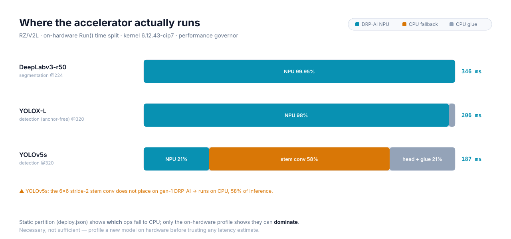

# Benchmarking DRP-AI models on hardware

Companion to [compiling-models.md](compiling-models.md). That doc turns a model
into a DRP-AI artifact; this one **runs a compiled artifact on the board and
measures it**, reproducibly, so anyone can execute the steps and reach the same
conclusions.

It uses `drpai-runner` — a model-agnostic inference driver (recipe
`meta-edge-bsp/recipes-support/drpai-tvm-runner`). Unlike the classifier tutorial
app, it carries no baked model: point it at any compiled model directory, it
loads, runs, and times `Run()` over N iterations, with a `/proc/interrupts`
witness that the NPU actually executed.

> **What you get:** latency distribution (min/median/mean/p95), an NPU-execution
> witness, CPU-side counters via `perf`, and the runtime's own per-operator
> breakdown via `ProfileRun`. Text over SSH — no display, no camera, no decoded
> output. This measures *latency and where the work runs*, not correctness.

## Prerequisites

1. **Compiled models.** One or more model directories (`deploy.so` / `deploy.json`
   / `deploy.params` / `preprocess/`) produced per
   [compiling-models.md](compiling-models.md). The examples below use
   `yolov5s_onnx`, `yolox_l_onnx`, `deeplabv3_r50` staged under `~/drpai-work/`.
2. **A reachable board** running an `EDGE_ENABLE_AI=1` image (the DRP-AI runtime
   libraries live at `/data/drpai/lib`; the driver node `/dev/drpai0` exists). Set
   a shell variable for it — no credentials belong in this doc:
   ```sh
   BOARD=devel@<board-ip>      # your board's ssh target
   ```
3. **On-board tools** (present in the AI image): `perf`, `taskset`. The governor
   should be `performance` for stable numbers:
   ```sh
   ssh $BOARD 'cat /sys/devices/system/cpu/cpu1/cpufreq/scaling_governor'   # expect: performance
   ```

## Step 1 — build the runner

From the repo root:

```sh
source scripts/env.sh
kas shell kas/local.yml -c 'bitbake drpai-tvm-runner'
BIN=$(find build/tmp/work -path '*drpai-tvm-runner*/image/usr/bin/drpai-runner' | head -1)
echo "$BIN"
```

The build is sstate-warm (its dependencies — `drpai-tvm-runtime`,
`kernel-module-drpai` — come from cache), so it is minutes, not a full image.

## Step 2 — deploy the binary and the models

```sh
ssh $BOARD 'mkdir -p /tmp/models'
rsync -az "$BIN" "$BOARD:/tmp/drpai-runner"
for m in yolov5s_onnx yolox_l_onnx deeplabv3_r50; do
    rsync -az ~/drpai-work/$m "$BOARD:/tmp/models/"
done
```

## Step 3 — measure latency (the headline number)

```sh
ssh $BOARD 'export LD_LIBRARY_PATH=/data/drpai/lib
    taskset -c 1 /tmp/drpai-runner /tmp/models/yolov5s_onnx -n 50 -w 5'
```

`taskset -c 1` pins to one core to cut migration jitter; `-w 5` discards 5 warmup
runs (cold caches / first-run DRP-AI config); `-n 50` times the next 50. Output:

```
=== /tmp/models/yolov5s_onnx ===
  load: 1521.7 ms   warmup: 5   iters: 50
  Run() latency ms:  min 187.21  median 187.78  mean 201.80  p95 329.80  stddev 43.01
  mac_nmlint IRQ: before=10 after=65 delta=55
```

- **`min` / `median`** are the least-noise latency. Use these to compare against
  Renesas' `Model_List_V2L.md` figures.
- **`p95` / `stddev`** expose jitter — a large gap from `min` means CPU-side ops
  contending on the pinned core (see the finding below).
- **`mac_nmlint` delta** is the NPU witness: the AI-MAC completion IRQ. It must
  scale with the run count (here 55 IRQs for 55 total `Run()` calls = every run
  hit the NPU). A flat delta means the model ran on CPU and the "latency" is
  meaningless. (Steps-per-run is model-dependent — 1 for these, 2 for the
  classifiers — so check that it *scales*, not that it equals a fixed number.)

## Step 4 — CPU-side counters with perf

```sh
ssh $BOARD 'export LD_LIBRARY_PATH=/data/drpai/lib
    perf stat -e task-clock,cycles,instructions,cache-misses,context-switches \
      taskset -c 1 /tmp/drpai-runner /tmp/models/yolov5s_onnx -n 50 -w 5'
```

Read **"CPUs utilized"**: it tells you how hard the A55 worked while the model
ran. `perf` sees only the A55 cores, *not* inside the DRP-AI block — so high CPU
utilisation means real CPU-side compute (or busy-waiting on the NPU), and low
utilisation means the CPU is idle while the NPU works.

## Step 5 — per-operator breakdown (the important one)

```sh
ssh $BOARD 'taskset -c 1 /tmp/drpai-runner /tmp/models/yolov5s_onnx -n 1 --profile'
# read the paths the runner prints; on the cip14 runtime they are:
ssh $BOARD 'cut -c1-135 /tmp/drpai_profile_table.txt; cat /tmp/drpai_profile.csv'
```

This is the runtime's own profiler (`ProfileRun`). It lists each operator, its
duration, and its share of the run. This is what static `deploy.json` cannot
give you: the **weight** of each CPU-fallback op. (The profiled run is a single,
instrumented, un-warmed run, so its absolute numbers run higher than the
steady-state `min` from Step 3 — read the *proportions*.)

## Expected results — reproduce these

Board RZ/V2L, kernel 6.12.43-cip7, `performance` governor. Steady `Run()`:

| Model | min ms | median ms | Model_List DRP-AI | NPU share (ProfileRun) |
|---|---|---|---|---|
| YOLOv5s @320 | ~187 | ~188 | 211 | **21 %** (stem conv on CPU) |
| YOLOX-L @320 | ~206 | ~206 | 199 | **98 %** |
| DeepLabv3-r50 @224 | ~346 | ~346 | 312 | **99.95 %** |

All land within ~15 % of Renesas' published figures — the check that the
method is sound.

**Kernel pin behind these numbers.** The table was measured on 6.12.43-cip7. The
platform kernel has since moved to 6.12.59-cip14; on that kernel only the
ResNet18 classifier was re-measured (32.75 ms native, 28.54 ms containerized —
in band). The table above has not been re-run, so treat it as the method's
reference output rather than a current-kernel measurement.

## The finding to reproduce



The two detectors look identical in the static partition (each: one `mera_drp`
subgraph plus a few CPU ops). At runtime they are **opposite**:

- **YOLOX-L** is 98 % accelerator — its 3×3 stem places on the DRP-AI.
- **YOLOv5s** spends **58 % of its inference in one CPU convolution** — its 6×6
  stride-2 stem (the Focus-replacement) does not place on gen-1 DRP-AI, so it
  runs on the A55 and dominates; the actual NPU backbone is only ~21 %.

Confirm it in the Step-5 table for `yolov5s_onnx`: the row
`fused_nn_conv2d_add_sigmoid_multiply` is ~58 % on `cpu`, while
`mera_drp_main_0` (the NPU subgraph) is ~21 %. For `yolox_l_onnx`,
`mera_drp_main_0` is ~98 %.

**The lesson:** static `deploy.json` scopes the question ("which ops fall to
CPU"); only the on-hardware profile answers it ("and do they dominate"). A
large-kernel, high-resolution stem conv is the gen-1 V2L fallback risk. Never
trust a latency estimate for a new model without this profile.

## Known limitations (current runner)

- **The input is not bound — confirmed on hardware.** The runtime reports
  `Mera1.x unsupports this function: GetInputInfo` and returns an empty tensor
  list, so `Run()` executes on whatever buffer the runtime allocated rather than a
  value you set.

  Note the shape of this defect, because it is easy to misread the source: the
  runner *does* call `GetInputInfo()` and `SetInput()`, and it compiles cleanly —
  the symbols exist. They just do nothing in this runtime mode. The binding loop
  iterates zero times, prints nothing, raises no error, and the process exits 0.
  Compile-time availability proved nothing about runtime behaviour here.

  **The timing figures are unaffected** — the workload is data-independent
  (fixed-function conv, branchless tensor ops), which is what this measurement
  always relied on. A runner that must produce *correct output* cannot use this
  idiom at all and needs the tutorial app's DRP-AI pre-processing path instead.
- **Profiler output path**: the runner prints the paths it wrote. On the cip14
  runtime they are single-extension (`/tmp/drpai_profile_table.txt`,
  `/tmp/drpai_profile.csv`) and land in `/tmp`, not the working directory. An
  earlier note here claimed the runtime appends its own extension
  (`*.csv.csv`) — that does not hold on this runtime, so read the paths the runner
  prints rather than constructing them.
- **IRQ witness message** prints a fixed `2*iters` expectation; the true
  steps-per-run is model-dependent — judge by whether the delta *scales*.

## Status

The build → deploy → measure → profile flow is **proven** (it produced the table
above). The `drpai-runner` recipe is in-tree but deliberately outside
`packagegroup-edge-ai`: it is a benchmark/recon tool, deployed by hand for a
measurement session, not the platform's production inference entry point. The
shipped workload is still the ResNet18 classifier app. Measurement is latency +
work-placement only; correctness/accuracy of model outputs is out of scope.
