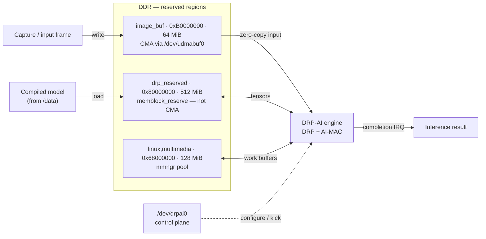

# DRP-AI integration notes

The non-obvious decisions and gotchas behind the DRP-AI integration — the material a
maintainer needs when touching these recipes, kept out of the [README](README.md) so
that stays orientation. Driver-port specifics are in [port-notes.md](port-notes.md).

## Runtime and app recipes

A compiled model is executed on-device by the **DRP-AI TVM / MERA runtime** (Renesas'
Apache-2.0 libraries), packaged as `drpai-tvm-runtime`. Three things shaped it:

> **"v2m runtime for V2L" — the trap.** Upstream ships prebuilt runtime libraries per
> SoC, and there is **no separate V2L build**: V2L consumes the **v2m** runtime (the
> upstream build system selects v2m for the V2L/V2M/V2MA family). Don't go hunting for
> a "v2l" artifact that was never produced.

- **`-dev` packaging so apps can build against it.** The prebuilt repo is library-only
  (`.so`, no headers). `drpai-tvm-runtime` sources the matching TVM headers at their
  pinned revision and ships a proper `-dev` package. Unversioned `.so` sonames route to
  the main package, headers to `-dev` — libs on the device, headers in the sysroot.
- **The app is a bitbake recipe, not an SDK exercise.** `drpai-tvm-app` is built *in
  the build*, against the platform's own toolchain and sysroot, so the binary's ABI is
  guaranteed to match the rootfs (same libc, C++ runtime, kernel UAPI). No "compiled
  against a slightly different SDK" bugs. The SDK stays available for off-device work
  but is off the critical path.

The version pin for the whole `rzv_drp-ai_tvm` upstream (runtime + app + the
[benchmark runner](benchmarking-models.md)) is shared in one place —
`recipes-support/drpai-tvm/drpai-tvm-src.inc` — so a release bump moves all consumers
in lockstep.

## Buffer architecture: three regions, one job each

The driver isn't the buffer engine, so the memory comes from three distinct reserved
regions — three lifetimes, three allocators. Conflating them is how you get silent
corruption.

| Region | Address | Size | Kind | Role |
|---|---|---|---|---|
| `drp_reserved` | `0x80000000` | 512 MiB | `memblock_reserve` carveout | Model + inference working set |
| `image_buf` (udmabuf) | `0xB0000000` | 64 MiB | CMA (`shared-dma-pool`) | Zero-copy input frames |
| `linux,multimedia` (mmngr) | `0x68000000` | 128 MiB | Memory-manager pool | Runtime work buffers |

> `/dev/drpai0` only *configures and triggers* the engine (control plane, dashed); the
> bulk tensors never flow through the driver — they live in the three regions. That is
> why the [driver port](port-notes.md) was small.

- **`drp_reserved`** — the accelerator's working set. A dedicated `memblock_reserve`
  carveout, *not* CMA. (Subtlety: the DT `reusable` keyword is a no-op without a
  `shared-dma-pool` compatible, so the region is genuinely reserved, not reclaimable.)
  The driver reports its base via ioctl; the runtime loads at `0x80000000`.
- **`image_buf` / udmabuf** — the zero-copy input path, a CMA region exposed as a
  dma-buf (`/dev/udmabuf0`); a capture source writes a frame and the accelerator
  consumes it with no bounce copy. Separate lifetime from the model's working set.
- **`linux,multimedia` / mmngr** — the managed pool for DRP work buffers. Already
  present in the base SoC device tree, so adopting it cost *zero* DT work; the modules
  and libs are OSS, simply enabled.

## The container lifecycle fix (a platform-wide bug)

Standing up the rootless workload surfaced a subtle ordering bug that affects **any**
lingering user, not just the AI principal:

> `systemd-logind` scans the linger markers at *its own* startup to decide which user
> managers to start. Those markers live under `/var/lib/systemd`, **bind-mounted from
> `/data`** — and logind was winning the race, scanning an empty directory before
> `/data` was bound, so it started **no** lingering managers at boot. The classic
> "rootless service works after I log in, but not at boot."

The fix is one ordering directive: logind ordered **`After=var-lib-systemd.mount`**, so
the markers are present when it scans. With that, the principal's user manager comes up
at boot on its own, its Quadlet generates, and the inference runs — no human in the
loop.

That closes the **fresh-flash** case. It does **not** yet close the **post-OTA** case:
after a RAUC slot switch, logind's linger enumeration fails on a `default_t`-labeled
`/var/lib/systemd` (a `User enumeration failed` log plus an SELinux AVC), so `user@608`
never starts and the Quadlet does not auto-run until the tree is relabelled. The ordering
fix above is validated as-deployed, not yet from a clean full-image build — see
[Status & roadmap](README.md#status--roadmap).

## Why a dedicated principal, not the operator login

An interactive developer login and a headless service runtime are two different trust
levels. Run the container as the SSH user and you couple its lifecycle to a human's
login session — the user-level systemd instance only exists while that human is "logged
in," so a reboot-survivable workload built on it is built on sand. Hence the dedicated,
`nologin`, linger-by-design `edge-ctr` principal (properties in the [README](README.md#container-native-identity)).
