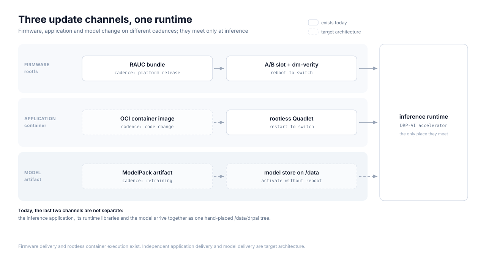

# Model updates over the air — a guide

**Who this is for:** anyone approaching model delivery on an embedded device for the
first time. It explains the *architecture* — why models get their own update channel,
what each step protects against, and what can go wrong.

It is a companion to [model-delivery.md](model-delivery.md), which records what this
repository has actually measured and implemented. This guide describes the general
shape; that document is the evidence. Where the two differ, the evidence wins.

---

## 1. Glossary

| Term | Meaning |
|---|---|
| **OCI** | Open Container Initiative. The standards behind container registries: how images are named, stored, addressed and distributed. |
| **OCI artifact** | Any content stored in a registry using those standards. A container image is one kind; a model package is another. |
| **Manifest** | A small JSON document listing an artifact's parts (its config and layers) by digest. |
| **Layer** | One blob of content in an artifact — for a model, the archive holding the compiled files. |
| **Digest** | A SHA-256 hash, written `sha256:<hex>`. Naming content by its hash means the name *is* an integrity check. |
| **Content-addressed** | Stored and retrieved by digest rather than by filename or tag. The same content always has the same address. |
| **Tag** | A mutable human-friendly pointer (`v2`, `latest`) to a digest. Tags move; digests do not. |
| **ModelPack** | A convention for packaging an ML model as an OCI artifact, with typed layers for weights, config, code and docs. |
| **Registry** | The server that stores and serves artifacts. |
| **Signature** | A cryptographic assertion, made with a private key, that a specific digest was approved by its holder. |
| **Detached signature** | A signature stored beside the artifact rather than inside it, so the artifact's digest stays stable. |
| **Sigstore / cosign** | A widely used ecosystem and tool for signing and verifying artifacts in registries. |
| **Verification policy** | Device-side rules deciding what is acceptable. A good one rejects by default and allows narrowly. |
| **Atomic activation** | Switching to a new model in a single step that either fully happens or does not happen at all. |

---

## 2. The three update clocks

The core insight, and the reason model delivery is its own problem:



**Firmware and root filesystem** change on a platform-release cadence: months. They
ship as a signed A/B bundle, and switching means a reboot. A bad one is recoverable
because the previous slot is still there.

**The inference application** changes when its code changes: weeks. It ships as a
container image and switching means restarting a container.

**The compiled model** changes whenever the model is retrained or retuned: possibly
weekly, possibly daily. It can be updated independently and changes far more often
than either of the others — it needs neither a reboot nor a container rebuild. Note
that a compiled model is not necessarily *small*: size varies by an order of
magnitude across model families, so the argument for a separate channel is cadence
and independence, not size.

Forcing the fastest clock through the slowest channel is the mistake. Shipping a
whole OS image to change a model means every model update carries the risk and the
downtime of a firmware update. Three cadences want three channels.

They stay separate all the way to the device, and meet at exactly one point: the
inference runtime that loads a model and executes it on the accelerator.

---

## 3. The end-to-end flow


Step by step, and what each step is for:

**Train / export.** A trained model is exported to an interchange format such as ONNX.
Nothing device-specific yet.

**Accelerator compile.** A vendor toolchain converts that into something the target
accelerator can execute. This output is target-specific: a model compiled for one NPU
does not run on another. On this platform the compiled directory also carries its own
pre-processing program — see [compiling-models.md](compiling-models.md).

**Deterministic pack.** The compiled directory is archived with fixed file ordering
and fixed metadata (timestamps, ownership, permissions), so packing identical inputs
twice yields byte-identical output. Without this, the digest changes on every rebuild
and the question "is this the model I approved?" becomes unanswerable.

**Manifest digest.** The manifest is hashed. That digest is the model's identity
everywhere afterwards.

**Signature.** The producer signs the digest with a private key. The signature is
stored beside the artifact.

**Registry.** The artifact is pushed. The registry sits **outside the trust root for
authenticity and integrity**: it is not trusted to vouch for content, because the
signature and the digest are checked on arrival regardless of who served them.

That is not a licence to run an unprotected registry. Production transport still
needs TLS, authentication, access control and availability — for confidentiality of
proprietary models, to stop unauthorised publishing, and because a registry that is
down is a fleet that cannot update. Verification protects against bad content, not
against a bad service.

**Device verification.** The device checks the signature against a public key it
already holds, under a policy that rejects anything unrecognised. This is the gate.

**Safe extraction.** Only after verification is the archive unpacked, and unpacking
must itself be defensive (§8).

**Compatibility validation.** Does this model match this accelerator and this runtime?
A correctly signed model can still be the wrong model for this device (§7).

**Atomic activation.** The active-model reference is switched in one step.

**Rollback.** The previous digest is retained, so reverting is another reference
switch rather than another download.

---

## 4. Why a ModelPack is an OCI artifact but not a container

This trips people up: the model is stored in a container registry, so surely you can
run it?

No. A container image contains a **root filesystem** plus a **config** naming an
entrypoint — the process a runtime starts. A ModelPack has none of those three: no
root filesystem, no runnable config, no entrypoint. It declares itself as model
content through its media types.

That is a statement about *runnability*, not about contents. A ModelPack layer is
still an ordinary blob and commonly *is* an archive of files — the compiled model
directory, tarred and compressed. The point is that nothing in it tells a container
runtime what to execute, so nothing can execute it.

So `docker run` or `podman run` on a ModelPack is meaningless. What you *can* do is
everything registries are good at: address it by digest, store it, mirror it,
distribute it, sign it, and copy it down to a device. The application that consumes
the model is a separate, ordinary container.

The practical payoff: model delivery reuses a decade of registry infrastructure
without pretending a model is a program.

---

## 5. Digest verification vs signature verification

Two different checks answering two different questions. Both are needed.

| | Digest verification | Signature verification |
|---|---|---|
| Question | "Did the bytes arrive intact?" | "Did *we* approve these bytes?" |
| Detects | truncation, corruption, bit-rot, a proxy mangling content | substitution by an attacker, an unapproved build, an artifact from anyone else |
| Needs | nothing but the expected digest | a trusted public key and a policy |
| Fails when | content does not hash to its digest | no signature, or one made by an untrusted key |

Digest alone is not security: an attacker who replaces the artifact simply publishes
the new digest too. Signature alone is not integrity: a signature covers a digest, so
without also checking that the content matches that digest, a corrupted download could
still be unpacked.

Order matters: **verify, then unpack.** An archive that has not been authenticated
should never be handed to an extractor.

---

## 6. Compatibility validation

A model that is authentic can still be wrong for the device in front of it:

- **Accelerator target** — compiled for a different NPU generation or a different SoC.
- **Runtime ABI** — compiled against a runtime version the device does not have.
- **Resource envelope** — needs more contiguous memory than this device reserves.
- **Application contract** — a detection model delivered to an application that only
  knows how to decode classification output.

Each of these produces a confusing runtime failure if unchecked, and a clear,
actionable error if checked at activation time. The artifact should therefore declare
what it expects, and the device should refuse a mismatch rather than discover it.

A useful principle from this platform's measurements: **do not duplicate, in metadata,
anything the compiled artifact already carries authoritatively.** Where the compiled
model contains its own pre-processing program, restating those settings in metadata
creates two sources of truth that can disagree. Descriptive metadata is still useful —
but as something to *validate against* the artifact, not as something that drives
execution.

---

## 7. Content-addressed storage, activation and rollback

A workable on-device layout separates *what is stored* from *what is active*:

```
models/
  blobs/sha256/<digest>/     unpacked models, addressed by content
  refs/<name>                a pointer: which digest is active
  staging/                   partial downloads, never visible to a consumer
```

**Storage by digest** means two models never collide, re-downloading a model you
already have is free, and the same content is always at the same address.

**Activation is a reference switch.** The consumer reads `refs/<name>`; changing which
digest it points at is the entire activation. Done with an atomic filesystem operation,
there is no moment where a consumer sees a half-written state.

**Rollback is the same operation in reverse**, and it is cheap precisely because the
previous digest was not deleted. Note that A/B firmware rollback does **not** cover
this: firmware rollback restores a root filesystem, while models live in persistent
storage that deliberately survives slot switches. Model rollback is its own mechanism.

**Garbage collection** removes digests nothing references — explicitly, never as a
surprise during boot.

---

## 8. Safe extraction

Extraction happens after verification, but a valid signature only proves the archive
is the one that was approved. If the *producer* is compromised or careless, the
archive can still be hostile. An extractor must therefore refuse:

- **Path traversal** — entries like `../../etc/passwd` escaping the target directory.
- **Absolute paths** — entries rooted at `/`.
- **Symlink and hardlink escape** — a link pointing outside the tree, then a later
  entry writing through it.
- **Decompression bombs** — a small archive expanding to exhaust storage. Bound the
  output size and the entry count.
- **Device nodes, setuid bits and unexpected modes** — a model payload needs plain
  files and directories, nothing else.
- **Duplicate entries** — the same path written twice to defeat an earlier check.

The safest extractors decide the rules first — target directory, size ceiling,
permitted entry types — and reject anything outside them, rather than trying to
sanitise as they go.

---

## 9. What happens when things go wrong

Designing the failure paths is most of the work. The good outcome is almost always
"the previously working model keeps running".

| Situation | Expected behaviour |
|---|---|
| **Interrupted fetch** | Partial content stays in staging and is never activated. Resume or restart; a half-downloaded model is not a model. |
| **Corrupt artifact** | Digest mismatch, refused before extraction. Nothing is written into the store. |
| **Invalid or missing signature** | Refused at the gate. Unsigned and wrong-key artifacts reach the **same activation outcome** — neither is installed — but they produce **diagnostically distinct errors**: "a signature was required, but no signature exists" versus a cryptographic verification failure. Operationally that distinction matters: the first often means a broken publishing step, the second a key mismatch or a substituted artifact. |
| **Missing model** | The consumer starts and reports that no model is active, rather than crash-looping. A device with no model is a device that needs one, not a broken device. |
| **Model fails to load** | Activation does not complete, or is reverted; the previous digest stays active. A model that cannot load must never become the active reference. |
| **Power loss mid-update** | Because activation is a single atomic switch, the device comes back running either the old model or the new one — never a mixture. Partial state in staging is discarded. |
| **Offline first boot** | A fresh device with no model and no network cannot fetch one. Either accept that inference starts only after connectivity, or ship a default model in the image and accept that it re-couples the model to the firmware clock. This is a deliberate trade-off, not an oversight. |

---

## 10. Status in this repository

Kept deliberately separate from the architecture above, because the architecture
describes the target and this describes today.

**Proven on hardware**

- Real-image inference with correct output, verified against an independent
  off-target reference — see [model-delivery.md](model-delivery.md).
- A signed model artifact accepted by the device's own stock tooling under a
  default-reject policy, with unsigned, wrong-key and corrupted variants each
  refused, and the corrupted one refused before extraction.
- Reproducible compilation and reproducible packaging, as separate results.

**Not implemented**

- The production artifact schema.
- Hostile-archive-safe extraction (§8).
- The registry choice, including transport security.
- The model store, activation and rollback lifecycle (§7).
- Production decoders for detection and segmentation.
- Integration with the running inference workload.
- Fresh-device validation with no hand-placed files.

Today a model still reaches the device by hand. The measured detail, including exact
outcomes and the constraints discovered, is in [model-delivery.md](model-delivery.md).

---

## 11. An illustrative manifest

**Non-normative.** This shows the *shape* of a ModelPack manifest — it is not this
project's schema, and the fields below are deliberately not frozen. Digests are
placeholders.

```jsonc
{
  "schemaVersion": 2,
  "mediaType": "application/vnd.oci.image.manifest.v1+json",
  "artifactType": "application/vnd.cncf.model.manifest.v1+json",
  "config": {
    "mediaType": "application/vnd.cncf.model.config.v1+json",
    "digest": "sha256:1111111111111111111111111111111111111111111111111111111111111111",
    "size": 372
  },
  "layers": [
    {
      "mediaType": "application/vnd.cncf.model.weight.v1.tar+gzip",
      "digest": "sha256:2222222222222222222222222222222222222222222222222222222222222222",
      "size": 13573695,
      "annotations": { "org.cncf.model.filepath": "model/" }
    },
    {
      "mediaType": "application/vnd.cncf.model.doc.v1.raw",
      "digest": "sha256:3333333333333333333333333333333333333333333333333333333333333333",
      "size": 1104
    }
  ]
}
```

A config blob might carry what the runner cannot infer — the output decoder class,
labels, decoder parameters, and the accelerator the model targets:

```jsonc
{
  "accelerator": "example-npu-gen1",
  "runtime": "example-runtime-2.x",
  "task": "classification",
  "labels": "labels.txt",
  "decoder": { "topK": 5 }
}
```

Deliberately absent: input shape and pre-processing settings, where the compiled
artifact already carries them authoritatively (§6).

---

## Further reading

**In this repository**

- [model-delivery.md](model-delivery.md) — the measured prototype and its evidence,
  including real-input inference correctness
- [compiling-models.md](compiling-models.md) — producing a compiled model artifact
- [benchmarking-models.md](benchmarking-models.md) — latency and accelerator
  work-placement measurement
- [DRP-AI on EDGE AI OS](README.md) — platform overview
- [OTA updates](../dev/ota-updates.md) — the firmware channel this one is separate from

**Specifications and tools**

- [ModelPack model specification](https://github.com/CloudNativeAI/model-spec)
- [OCI image specification](https://github.com/opencontainers/image-spec)
- [OCI distribution specification](https://github.com/opencontainers/distribution-spec)
- [Sigstore](https://www.sigstore.dev/) · [cosign](https://github.com/sigstore/cosign)
