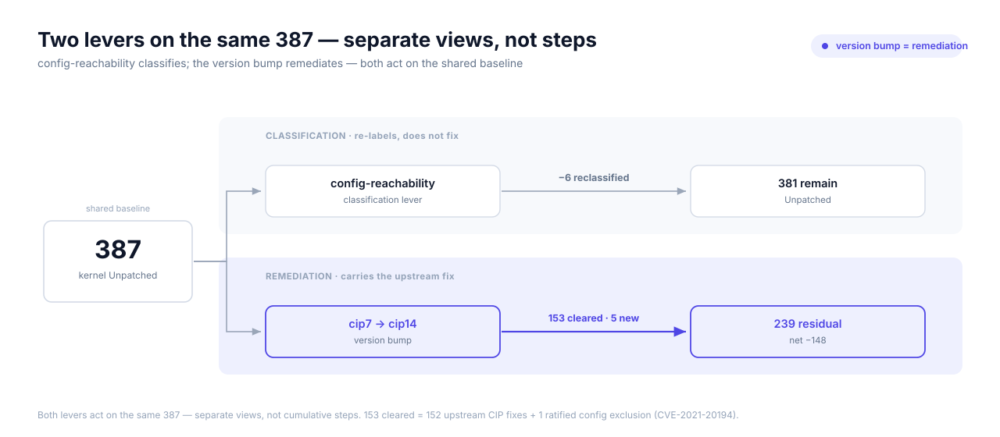
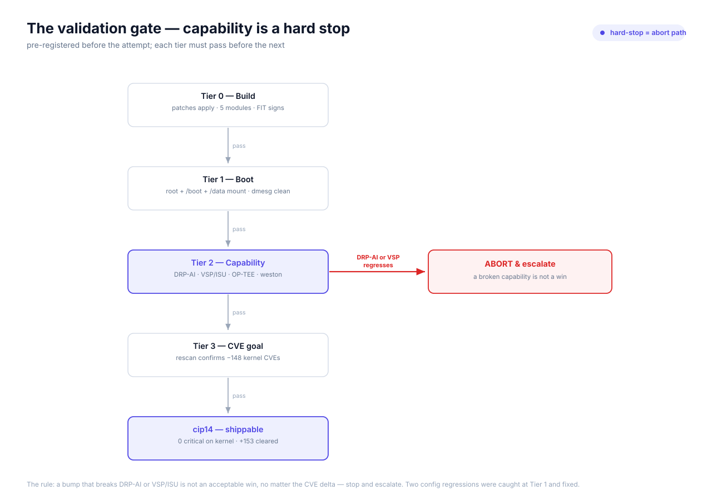
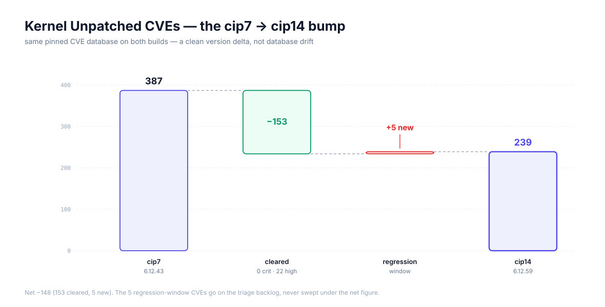

# Kernel CVE reduction — a case study: `linux-renesas` cip7 → cip14

**Case study and decision record** for the kernel CVE line. It follows one
number — the kernel's **387** Unpatched CVEs, 82% of the image's entire Unpatched
surface — from the scan that surfaced it, through a triage method that honestly
**could not move it**, to the hardware-validated version bump that did: **−148**
net, **153 CVEs cleared**, **zero** remaining critical on the kernel. It records
what the scan produced, why triage stalled, the bump that was chosen and the
constraint that made it risky, the capability gate it had to clear, **what broke
on the first boot** (SELinux ext4 mounts, then the Linux OP-TEE interfaces), and
how each break was caught and resolved.

Read alongside [`kernel-cve-triage.md`](kernel-cve-triage.md) (the triage method
this study starts from) and [`vuln-mgmt-architecture.md`](vuln-mgmt-architecture.md)
(the workstream's decisions and measured baseline).

---

## 📊 What the scan found

Every `edge-ai` build emits an SBOM and runs the CVE check — non-negotiable,
wired always-on in `meta-edge-distro/conf/distro/include/edge-floor.inc`
(`INHERIT += "create-spdx"`, `IMAGE_CLASSES:append = " sbom-cve-check"`, with the
NVD/CVEList SHAs pinned for a reproducible record). The scan writes a per-image
`*.sbom-cve-check.yocto.json`; [`scripts/cve-report.py`](../../scripts/cve-report.py)
summarises it.

> ⚠️ **Snapshot — before any triage.** Build `20260623172940`,
> `linux-renesas 6.12.43-cip7+git`. These are the *starting* numbers, not residual
> exposure.

| Status | Count |
|---|---:|
| ✅ Patched | 16,575 |
| 🟡 Ignored | 896 (mostly inherited from upstream layers) |
| 🔴 **Unpatched** | **472** — **387 kernel** / 85 userland |

Severity across the 472: 1 critical, 79 high, 181 medium, 25 low, 186 unscored.

One recipe — `linux-renesas` — is **387 of 472** Unpatched findings. The userland
85 fan out to a 43-item human worklist through
[`cve-triage-funnel.py`](../../scripts/cve-triage-funnel.py); the kernel is parked
as a **single line**, because a flat CVE list is the wrong instrument for it. The
kernel is the elephant, and it needs its own method.

## Why triage alone couldn't move it — the honest delta

The kernel's method is config-reachability (OQ-5, see
[`kernel-cve-triage.md`](kernel-cve-triage.md)): oe-core's
`improve_kernel_cve_report.py` enriches the report with two inputs the version-only
scan ignores — the kernel-CNA `cvelistV5` metadata (affected version ranges +
`programFiles`) and **the set of files actually compiled** into this `.config`
(from the debug-sources manifest, on disk because
`SPDX_INCLUDE_COMPILED_SOURCES:pn-linux-renesas = "1"`). A CVE that is
version-in-range but whose affected files were **not compiled** is not real
exposure — it becomes `not-applicable-config`.

The instrument is powerful over the whole CNA universe: across the **10,506**
kernel CVEs it evaluates, it disposes 9,342 as `version-not-in-range` and 868 as
`not-applicable-config`, leaving 296 needing backport. Its validation gate — three
checks that catch the path-alignment **count-gaming trap** — passes on this build
(6,009 compiled files; **0** ext4 CVEs wrongly dropped).

But the number that matters is the effect on the **387** the shipped report marks
Unpatched. There, enrichment moves only **6**:

| Move | Count |
|---|---:|
| → `not-applicable-config` (Ignored, CIP-safe) | 4 |
| → `fixed-version` (Patched) | 2 |
| **remain Unpatched** | **381** |

*This is the honest delta.* `sbom-cve-check` is already version-aware, so the CVEs
it leaves Unpatched are overwhelmingly **recent fixes in core, compiled
subsystems** — exactly the class a config-reachability filter cannot clear. The
filter is strong over the CNA universe and weak over the already-Unpatched set.
The published "70–80% reduction" for this script was measured on mainline/qemu
configs; it does not transfer to a broad board config.

The value of that pass is not the 6 moves — it is the **evidence** attached to the
381 survivors: **303** carry a *fixed-from-version boundary*, 78 carry no clean
boundary (escalate). And that clause — 303 CVEs each waiting on a specific
upstream version — is the entire case for what comes next.

## The pivot — two levers, and only one fixes a real CVE

The kernel count is two disjoint problems that need two different tools:

| Lever | Handles | Instrument |
|---|---|---|
| Config-reachability triage | CVEs that **don't apply** to this build | `improve_kernel_cve_report.py` (above) |
| **Kernel version bump** | CVEs that **do apply** — real exposure in a compiled subsystem | a kernel that carries the upstream fix |



Both levers act on the **same 387** — they are separate *views*, not cumulative
steps: classification re-labels what does not apply (−6, leaving 381), remediation
carries the upstream fix (−148 net). Triage disposed of what it could and honestly stopped. A real CVE in a compiled
subsystem is not argued away; it is *fixed* by moving to a kernel that carries the
patch. The 303 survivors with a fixed-from-version boundary are not a backlog to
cherry-pick one at a time — they are a threshold: **a newer kernel crosses them
wholesale.**

*Decision:* bump `linux-renesas` from CIP `rz-6.12-cip7` (6.12.43) to
`rz-6.12-cip14` (6.12.59) — **16 CIP stable point releases** of upstream fixes,
in one move.

## The constraint that made the bump risky

A version bump on this board is not a one-line pin change. Renesas' `meta-renesas`
BSP pins **cip7** — the last tag it declares board-complete for RZ/V2L — and the
`cip8`+ branches (cleaner CIP-base rebases) **dropped** the RZ/V2L *downstream*
board enablement that the AI accelerator and the hardware video path depend on:

| Dropped in cip8+ | Consumed by |
|---|---|
| `reserved-memory` regions (`linux,cma@58000000`, `linux,multimedia@68000000`) | mmngr / the DRP-AI CMA pools |
| ISU (Image Scaling Unit) module clocks + resets in the CPG driver | the VSP/ISU hardware convert path |

A naïve bump would silently break DRP-AI inference and hardware video convert —
trading the accelerator the board exists for against a lower CVE count. **That is
not an acceptable win**, and the plan had to treat it as a hard failure, not a
regression to note.

## What was weighed

| Option | Verdict | Reason |
|---|---|---|
| **A** — targeted stable backports onto cip7 | 🔴 rejected | per-CVE cherry-pick × 153 is an unbounded carry with no wholesale win; every backport is a fresh do_patch risk |
| **B** — forward-port to cip14, re-carry the dropped board content | ✅ **chosen** | the missing content is small and auditable; clears all 153 at once against an upstream-blessed base |
| **C** — wait for a board-complete BSP past cip7 | 📅 watch-item | not on Renesas' published cadence; tracked in parallel, not blocking |

The forward-port turned out to be **~22 downstream lines**: patch `0009` restores
the reserved-memory container + CMA/multimedia pools; patch `0010` restores the
ISU clocks/resets (plus the `common[]` array-bound bump cip14's driver refactor
forced). The DRP-AI out-of-tree driver needed **zero** changes — its
`LINUX_VERSION_CODE` guards are all ≤ 6.11, so it compiles identically on 6.12.43
and 6.12.59.

## The validation gate — capability is a hard stop

Acceptance criteria were fixed **before** the attempt, so "stable" is a pass/fail
gate, not a post-hoc judgement. Each tier must fully pass before the next is
attempted.



| Tier | Gate | Result |
|---|---|---|
| **0 — Build** | all patches apply; kernel + DTBs + all 5 out-of-tree modules compile; FIT signs | ✅ |
| **1 — Boot** | boots to login; root + `/boot` + `/data` mount; `dmesg` clean; no new failed units | ✅ |
| **2 — Capability** | DRP-AI inference in the proven band; VSP/ISU convert; weston; containers; OP-TEE; SELinux | ✅ |
| **3 — CVE goal** | rebuild + rescan; confirm the projected kernel-CVE reduction | ✅ |

> **The hard rule.** A bump that breaks DRP-AI or VSP/ISU is **not** an acceptable
> win no matter the CVE delta — stop and escalate. It never had to be invoked; but
> Tier 1 came close, twice.

## What broke — the war story

Tier 0 passed clean. Tier 1 booted the bumped kernel to a login prompt, DRP-AI
driver and all five modules loaded — and then `/boot` and `/data` refused to mount:

```
EXT4-fs (mmcblk0p1): mounted filesystem ... r/w with ordered data mode.
SELinux: (dev mmcblk0p1, type ext4) has no security xattr handler
EXT4-fs (mmcblk0p1): unmounting filesystem ...
boot.mount: Mount process exited, code=exited, status=32/n/a
Failed to mount /boot.
```

One failed mount cascaded into a dozen dependency failures — weston, containers,
persistent `/home` and `/var/log`, the RAUC env service. The running kernel's
`/proc/config.gz` gave the root cause directly:

```
# CONFIG_EXT4_FS_SECURITY is not set
```

SELinux was enabled, but ext4 had no `security.*` xattr handler, so systemd's
post-policy mounts could not establish a context and exited `32`. cip7's config
had `CONFIG_EXT4_FS_SECURITY=y` — inherited silently from the meta-renesas
defconfig, never pinned in a fragment, and quietly dropped at cip14.

**One dropped symbol invites the question: what else?** Rather than fix the one
break and move on, the whole config was diffed — cip7's resolved `.config`
(recovered from its build's Image via `extract-ikconfig`) against cip14's — under
the same pinned CVE-DB discipline the CVE work uses. It caught a **second**
regression the first boot had not yet reached:

```
$ ls /dev/tee*
ls: cannot access '/dev/tee*': No such file or directory
$ systemctl is-active tee-supplicant@teepriv0     # inactive
$ cat .../hw_random/rng_current                    # none
```

`CONFIG_TEE` and `CONFIG_OPTEE` were gone — the Linux OP-TEE interfaces were
absent, which also explained why the fragment's `CONFIG_HW_RANDOM_OPTEE`
request could not resolve (its parent was missing).

**Two regressions, one root cause** — and the distinction matters, because it is
the same failure mode wearing two masks:

| | `EXT4_FS_SECURITY` | `TEE` + `OPTEE` |
|---|---|---|
| Origin | meta-renesas defconfig, cip7 → dropped cip14 | meta-renesas defconfig, cip7 → dropped cip14 |
| In a repo fragment? | **No** — inherited, never pinned | **No** — inherited, never pinned |
| Caught by `do_kernel_configcheck`? | **No** — a defconfig-only symbol, not a requested one | **No** — same |
| Surfaced by | the config-delta audit, not the build gate | the config-delta audit, not the build gate |

Both were defconfig drift; both were invisible to the build's own config check
precisely because nothing in-tree ever *requested* them. The fix is to stop
inheriting them and pin them explicitly, so they cannot drift again:

| Step | Action | Where |
|---|---|---|
| 1 | pin `CONFIG_EXT4_FS_SECURITY=y` | `meta-edge-bsp/recipes-kernel/linux/files/cfg/security-hardening.cfg` |
| 2 | pin `CONFIG_TEE=y` + `CONFIG_OPTEE=y` | `meta-edge-bsp/recipes-kernel/linux/files/cfg/hwcrypto-hwrng.cfg` |

The OP-TEE fix was *verified* to need only the kconfig, not a code port: the
driver is vanilla upstream (the cip7→cip14 delta is 21 lines of upstream fixes),
its DT `firmware/optee` node is injected by U-Boot at boot (version-independent),
and OP-TEE OS runs as BL32 firmware regardless of the kernel. Re-pinning rebuilds
the same driver against the same node — nothing to forward-port.

## Verification — the fix holds

Rebuilt, reflashed, re-tested. The config re-diff confirmed the fix was surgical:
**exactly** the four intended symbols flipped on (`EXT4_FS_SECURITY`, `TEE`,
`OPTEE`, `HW_RANDOM_OPTEE`), **zero** collateral changes. On hardware
(`6.12.59-cip14`):

| Capability | Evidence |
|---|---|
| `/boot` + `/data` mount | `mmcblk0p1`/`mmcblk0p4` ext4, no `status=32`, `systemctl --failed` empty |
| OP-TEE | `/dev/tee0` + `/dev/teepriv0`, `tee-supplicant@teepriv0` running, hwrng `rng_current=optee-rng` |
| DRP-AI inference | ResNet18 native **32.75 ms** and inside the rootless container **28.54 ms** (both in the proven 27–33 ms band), top-1 `beagle` |
| VSP/ISU (patch `0010`) | `vspmfilter` NV12 720×480 = 529,920 B — a **736-stride** luma (the ISU DMA-alignment signature: real hardware convert, not a software fallback), zero invalid-channel errors |
| Display / containers | weston up (`/run/weston/wayland-1`); podman rootless pull + run + device passthrough |

Tier 2's hard rule held: **no validated capability was traded for the CVE win.**

## 📊 The payoff

Both kernels were scanned under the **same pinned CVE database** (`cvelistV5` +
`nvd-json-data-feeds`, identical HEADs for both builds), so this is a clean version
delta, not database drift. The cip7 baseline was reproduced by rebuilding the
committed cip7 tree in an isolated git worktree (per the worktree flow in
`CLAUDE.md`) with the scan on, then diffing the two reports' `linux-renesas`
Unpatched CVE-ID sets.



| Metric | cip7 (6.12.43) | cip14 (6.12.59) |
|---|---:|---:|
| Kernel Unpatched CVEs | **387** | **239** |

| Movement | Count | CVSS |
|---|---:|---|
| ✅ **Cleared** by the bump | **153** | 0 critical · 22 high · 40 medium · 1 low · 90 unscored |
| 🔴 New at cip14 (regression window) | 5 | — |
| **Net kernel reduction** | **−148** | — |

The result *exceeds* the pre-registered ~140 projection. After the bump the kernel
carries **0 critical** Unpatched CVEs and 22 fewer high. The full 153 are in the
[appendix](#appendix--the-153-cleared-cves).

## The honest footnote — 5 new CVEs

Five CVEs are Unpatched on cip14 but not on cip7 — genuine regression-window
entries (a fix boundary landing after 6.12.43 but not yet in 6.12.59), *not*
database noise (a differing DB would have inflated this set with dozens). They go
on the triage backlog, never swept under the net figure:

> `CVE-2025-68300`, `CVE-2025-71123`, `CVE-2026-23049`, `CVE-2026-23145`,
> `CVE-2026-23159`

A future CIP tag is the lever for these — exactly as cip14 was for the 153.

## Where this leaves the kernel line

- **239 residual** feeds straight back into the config-reachability triage line
  (161 `version-in-range` + 78 `no-version-ranges`) — see
  [`kernel-cve-triage.md`](kernel-cve-triage.md). Triage and the bump are the same
  strategy applied to disjoint halves of the count.
- The ratified `not-applicable-config` disposition lives in
  `meta-edge-bsp/recipes-kernel/linux/files/cve-exclusion-renesas-6.12.inc`; its
  version pin must track the kernel so a future bump invalidates stale entries.

## Out of scope

- **Renesas out-of-tree code.** The kernel-CNA data describes *mainline* Linux.
  DRP-AI, RZ-specific drivers, and the in-tree board patches (`0001`–`0010`) are
  invisible to it: "239 Unpatched" is coverage of the *mainline-tracked subset*,
  not "the kernel is covered." Out-of-tree exposure is tracked separately.
- **Userland CVEs** — the 85 userland Unpatched and the Grype language-layer
  breadth (OQ-2) are the funnel's remit, not this study's.

## Reproducing the comparison

The pinned cip14 acceptance scan dated **2026-07-17** is the
`*.sbom-cve-check.yocto.json` measurement. The cip7 baseline was reproduced
without disturbing the working tree by building the committed cip7 state with
the scan enabled, then diffing
the two reports' `linux-renesas` `status == "Unpatched"` CVE-ID sets with
`scripts/cve-report.py`. Both reports used cvelistV5 revision
`ada54ee3cc8380820aa45e4996910bdc9dcb94e7` and nvd-json-data-feeds revision
`49f8bbe1b0b0884e16bdc37ab68db997085570a7`. Later database refreshes can
change the absolute residual; they do not invalidate the measured same-database
`387 → 239` delta.

## Appendix — the 153 cleared CVEs

<details>
<summary>Full list — <code>linux-renesas</code>, Unpatched on 6.12.43-cip7, resolved on 6.12.59-cip14</summary>

```
CVE-2021-20194, CVE-2025-22103, CVE-2025-22113, CVE-2025-22121, CVE-2025-38306,
CVE-2025-38453, CVE-2025-38502, CVE-2025-38556, CVE-2025-38678, CVE-2025-38730,
CVE-2025-38732, CVE-2025-39683, CVE-2025-39689, CVE-2025-39691, CVE-2025-39697,
CVE-2025-39698, CVE-2025-39723, CVE-2025-39724, CVE-2025-39759, CVE-2025-39764,
CVE-2025-39765, CVE-2025-39766, CVE-2025-39770, CVE-2025-39773, CVE-2025-39779,
CVE-2025-39782, CVE-2025-39783, CVE-2025-39791, CVE-2025-39800, CVE-2025-39813,
CVE-2025-39816, CVE-2025-39817, CVE-2025-39829, CVE-2025-39843, CVE-2025-39844,
CVE-2025-39852, CVE-2025-39865, CVE-2025-39866, CVE-2025-39881, CVE-2025-39883,
CVE-2025-39884, CVE-2025-39886, CVE-2025-39894, CVE-2025-39895, CVE-2025-39900,
CVE-2025-39902, CVE-2025-39903, CVE-2025-39913, CVE-2025-39914, CVE-2025-39917,
CVE-2025-39926, CVE-2025-39931, CVE-2025-39940, CVE-2025-39953, CVE-2025-39955,
CVE-2025-39963, CVE-2025-39964, CVE-2025-39977, CVE-2025-39980, CVE-2025-39984,
CVE-2025-39990, CVE-2025-39992, CVE-2025-40006, CVE-2025-40009, CVE-2025-40019,
CVE-2025-40021, CVE-2025-40027, CVE-2025-40030, CVE-2025-40031, CVE-2025-40040,
CVE-2025-40042, CVE-2025-40047, CVE-2025-40049, CVE-2025-40057, CVE-2025-40070,
CVE-2025-40078, CVE-2025-40080, CVE-2025-40083, CVE-2025-40100, CVE-2025-40105,
CVE-2025-40109, CVE-2025-40123, CVE-2025-40125, CVE-2025-40129, CVE-2025-40134,
CVE-2025-40142, CVE-2025-40153, CVE-2025-40159, CVE-2025-40160, CVE-2025-40167,
CVE-2025-40169, CVE-2025-40173, CVE-2025-40178, CVE-2025-40179, CVE-2025-40183,
CVE-2025-40190, CVE-2025-40195, CVE-2025-40196, CVE-2025-40197, CVE-2025-40198,
CVE-2025-40199, CVE-2025-40200, CVE-2025-40201, CVE-2025-40203, CVE-2025-40205,
CVE-2025-40206, CVE-2025-40207, CVE-2025-40209, CVE-2025-40214, CVE-2025-40219,
CVE-2025-40226, CVE-2025-40230, CVE-2025-40235, CVE-2025-40237, CVE-2025-40239,
CVE-2025-40251, CVE-2025-40271, CVE-2025-40272, CVE-2025-40292, CVE-2025-40297,
CVE-2025-40302, CVE-2025-40303, CVE-2025-40319, CVE-2025-40323, CVE-2025-40337,
CVE-2025-40341, CVE-2025-40346, CVE-2025-40353, CVE-2025-40360, CVE-2025-68167,
CVE-2025-68173, CVE-2025-68178, CVE-2025-68179, CVE-2025-68185, CVE-2025-68186,
CVE-2025-68188, CVE-2025-68199, CVE-2025-68200, CVE-2025-68204, CVE-2025-68208,
CVE-2025-68241, CVE-2025-68242, CVE-2025-68317, CVE-2025-68321, CVE-2025-68815,
CVE-2025-71066, CVE-2026-22976, CVE-2026-22999, CVE-2026-23074, CVE-2026-23105,
CVE-2026-23123, CVE-2026-23204, CVE-2026-23253
```

</details>

`CVE-2021-20194` is the one already-ratified `not-applicable-config` exclusion
(HARDENED_USERCOPY is `=y`); the remaining 152 are cleared by upstream CIP fixes
carried in 6.12.59.
