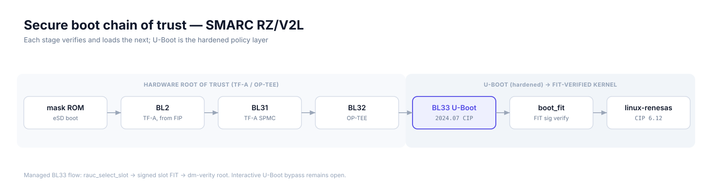

# U-Boot hardening

Architecture, design decisions, and implementation reference for
U-Boot surface reduction on the EDGE AI OS distro. Maps to CRA Annex I
Part I §1 (minimum attack surface, hardened build flags) — see
[CRA-CONTROLS.md](CRA-CONTROLS.md) for the requirements view.

---

## Overview

U-Boot is the highest-privilege software stage this project controls. On
the SMARC RZ/V2L EVK, the boot chain is:



TF-A currently reports `TRUSTED_BOARD_BOOT=0` and `MEASURED_BOOT=0`.
Authentication therefore starts at U-Boot's embedded FIT public key, not at a
hardware root. U-Boot is also an interactive shell whose remaining commands can
bypass the managed boot macro. This document describes the normal A/B path and
surface reduction; it does not claim console-resistant secure boot.

The hardening addresses three orthogonal objectives:

1. **Verify the managed boot artifact** — disable legacy uImage and require a
   valid signature when the normal path invokes `bootm` on a slot FIT.
2. **Reduce attack surface** — remove U-Boot commands that the
   appliance boot path and field diagnostics do not use.
3. **Build-loader self-protection** — native stack canary at U-Boot
   (deferred, not yet active — see "Explicit deferrals").

All changes are additive to the FIT signing infrastructure and preserve
RAUC A/B update compatibility.

---

## Design philosophy

### Modular feature tokens

Hardening is not monolithic. A single variable `EDGE_UBOOT_FEATURES`
controls which hardening layers are active:

| Token | Purpose | Safe for dev? |
|---|---|---|
| `surface_reduce` | Disable unused commands (usb, storage, loadb/loads) | Yes |
| `net_off` | Drop U-Boot network commands when netboot is off | Yes (skipped when `EDGE_DEV_NETBOOT=1`) |
| `fit_enforce` | Reassert legacy image format off | Yes |

Tokens are additive. Default for every image is the full set:

```bitbake
EDGE_UBOOT_FEATURES ?= "surface_reduce net_off fit_enforce"
```

### Layering over the Renesas defconfig

The implementation uses two mechanisms:

1. **Renesas CIP defconfig** — the upstream `smarc-rzv2l_defconfig`
   shipped by meta-renesas. Already disables many legacy/insecure
   options (`CMD_NFS`, `CMD_PXE`, `CMD_WGET`, `CMD_DNS`, `CMD_LICENSE`,
   `CMD_SOURCE`, `LEGACY_IMAGE_FORMAT`). Hardening additions sit on
   top, not in place of, this baseline.
2. **Conditional `.cfg` fragments** — three tokenized Kconfig overlays
   applied via Python conditionals in `u-boot_2024.07.bbappend`. Each
   fragment maps 1:1 to a feature token.

Why split: the defconfig is owned upstream by Renesas and evolves with
SoC support; fragments capture distro-specific policy without
mutating that baseline.

### Dev / prod symmetry, dev-netboot escape

The same three tokens apply to every image tier. The single dev-only
escape hatch is `EDGE_DEV_NETBOOT=1`, which selects the
`kas/dev-netboot.yml` fragment chain. When set:

- `net_off` is **skipped** at parse time (the bbappend's
  `EDGE_DEV_NETBOOT != "1"` condition).
- `CMD_NET`, `CMD_DHCP`, `CMD_TFTPBOOT` stay on, enabling the
  `rauc-uboot-env-init` service to populate a `netboot` env macro.
- All other hardening (`surface_reduce`, `fit_enforce`) remains
  active.

A dev-netboot build is therefore strictly a network-bring-up dev
profile, not a hardening downgrade. FIT signature verification, the
RAUC slot model, and the BL2/FIP raw boot chain are unchanged.

---

## Architecture

### A/B slot selection

RAUC A/B logic lives in U-Boot's persistent environment (`mmc env`,
raw MMC area `0x1F0000`-`0x230000`). The `bootcmd` macro runs:

```
rauc_init           → seed BOOT_ORDER / BOOT_x_LEFT if absent
rauc_select_slot    → choose A or B, decrement counter
rauc_validate_slot  → fall back to A if no slot has attempts left
boot_fit            → load fitImage-A/B; signed DTB supplies verity cmdline
```

| Env var | Role | Owner |
|---|---|---|
| `BOOT_ORDER` | Slot priority (`A B` or `B A`) | RAUC at OTA, init at first boot |
| `BOOT_A_LEFT` / `BOOT_B_LEFT` | Remaining attempt counter | RAUC + U-Boot decrement |
| `rauc_slot` | Selected slot for this boot | U-Boot scratch |
| `EDGE_VERITY_A` / `EDGE_VERITY_B` | Slot has a matching signed verity FIT | bundle hook / first-boot init |
| `EXTRA_KERNEL_ARGS` | Transitional legacy-slot cmdline appendix | `rauc-uboot-env-init.service` |

### FIT verification chain

`CONFIG_FIT_SIGNATURE=y` is on in the base defconfig. The U-Boot DTB
embeds the public key (`UBOOT_SIGN_ENABLE=1` +
`UBOOT_SIGN_KEYDIR=keys/dev/fit/`). The FIT itself is signed
`sha256,rsa2048` at the configuration node level — `bootm` rejects an
unsigned or mis-signed config.

`fit_enforce` adds a legacy-format regression guard: even if a future Renesas
defconfig sync flipped `CONFIG_LEGACY_IMAGE_FORMAT=y` back on, the
fragment overlay restores it to off. It does not remove `booti`, memory access,
or every alternate command reachable from an interrupted shell.

### Shared `/boot` partition (paired FITs)

The shared filesystem contains `/boot/fitImage-A` and `/boot/fitImage-B`.
Each signed DTB binds its root hash and physical rootfs partition. OTA replaces
only the inactive slot FIT before setting its verity-ready environment marker.
An unconverted slot can temporarily use `/boot/fitImage` during migration.

---

## What is hardened

### `surface_reduce` — universal disables

| Symbol | Before | After | Reason |
|---|---|---|---|
| `CONFIG_CMD_USB` | y | **n** | RZ/V2L boots from eSD via SoC mask ROM. USB is not in `boot_targets` and not used by the splash-load or FIT-load paths. |
| `CONFIG_USB_STORAGE` | y | **n** | Same — block-device layer above `CMD_USB`. |
| `CONFIG_USB_XHCI_HCD` | y | **n** | USB 3.x host controller driver. Host mode is unused at U-Boot; disabling the HCDs deselects `USB_HOST` (both HCDs `select` it, so the HCDs are the symbols to disable). `USB_XHCI_RCAR` is a hidden child and drops with it. |
| `CONFIG_USB_EHCI_HCD` | y | **n** | USB 2.0 host controller driver. Same. |
| `CONFIG_CMD_LOADB` | y | **n** | Kermit serial download. Unused — flashing is via `bmaptool` from host or RAUC bundle from network. |
| `CONFIG_CMD_LOADS` | y | **n** | S-record serial download. Same. |

More important than size: every removed command or driver is one fewer
code path the FIT-verified-boot chain has to treat as trusted.

The gadget (device-mode) side is deliberately retained: `CONFIG_USB`,
`CONFIG_USB_GADGET`, `CONFIG_USB_RENESAS_USBHS` (the dedicated function
controller — a separate IP block from the xHCI/EHCI hosts), and the
`ums` command (`CONFIG_CMD_USB_MASS_STORAGE`). `ums` exposes eMMC/SD to
a connected PC as USB mass storage and is the established eMMC flashing
path on this board. It is reachable only from the U-Boot prompt, which
is gated by the keyed autoboot stop string. The Linux-side counterpart
is the opposite: the kernel drops `USB_GADGET` (no runtime consumer,
`surface-trim.cfg`) and keeps USB host for the carrier hub and UVC
capture — the two configs are independent builds and do not need to
match.

`CONFIG_STACKPROTECTOR` is left at the defconfig default — see deferral
note below.

### `net_off` — gated network commands

Applied when `EDGE_DEV_NETBOOT != "1"`:

| Symbol | Effect |
|---|---|
| `CONFIG_CMD_NET=n` | Removes all interactive network commands (bootp, dhcp, tftpboot, ping, …). |
| `CONFIG_CMD_DHCP=n` | Child of `CMD_NET` — already removed by the parent; kept as defensive re-assertion. |
| `CONFIG_CMD_TFTPBOOT=n` | Child of `CMD_NET` — same. |

`CMD_DHCP` and `CMD_TFTPBOOT` live inside `if CMD_NET` in `cmd/Kconfig`,
so once the parent is off, Kconfig drops the children from the resolved
`.config` entirely — the two fragment lines cannot appear in it and are
redundant by construction.

This removes the network command *entry points*, not the network stack:
the resolved config retains `CONFIG_NET=y`, `CONFIG_ETH=y`,
`CONFIG_NETDEVICES=y`, and `CONFIG_BOOTDEV_ETH=y`, so the eth driver and
protocol core remain compiled in. Dropping `CONFIG_NET` itself is an
open follow-up decision, weighed against dev-netboot needs.

### `fit_enforce` — regression guard

| Symbol | Effect |
|---|---|
| `CONFIG_LEGACY_IMAGE_FORMAT=n` | Reasserts the Renesas defconfig disable; catches a future defconfig sync that would re-enable legacy uImage. |

No size change today (the Renesas defconfig already disables it). The
value is provenance: a `make menuconfig` regeneration cannot silently
relax this.

### What Renesas already disables

The smarc-rzv2l defconfig is more locked down than a generic
defconfig out-of-the-box. Already off without any fragment from this
layer:

- `CONFIG_CMD_NFS`, `CONFIG_CMD_PXE`, `CONFIG_CMD_WGET`, `CONFIG_CMD_DNS`
- `CONFIG_CMD_LICENSE`, `CONFIG_CMD_SOURCE`, `CONFIG_CMD_IMLS`
- `CONFIG_LEGACY_IMAGE_FORMAT`
- Several memory and board-inspection commands remain. The resolved artifact
  has `CONFIG_CMD_MEMORY=y` and `CONFIG_CMD_BDI=y`; they are part of the
  interactive-shell bypass threat until separately removed.

### Signed verity cmdline and legacy appendix

Normal verified boot clears the environment `bootargs`; the slot FIT's signed
DTB supplies the complete root and hardening command line. `${EXTRA_KERNEL_ARGS}`
is used only by the transitional legacy-slot path:

```
EXTRA_KERNEL_ARGS=security=selinux hash_pointers=always \
                  hardened_usercopy=1 kfence.sample_interval=100 \
                  proc_mem.force_override=never
```

| Token | Purpose |
|---|---|
| `security=selinux` | Activate SELinux LSM. Mode (permissive / enforcing) comes from `/etc/selinux/config`; the policy travels with the image. |
| `hash_pointers=always` | Hash every kernel pointer printed via `%p`, including for root. Defeats info-leak via dmesg. |
| `hardened_usercopy=1` | Runtime bounds check on `copy_{to,from}_user`. Pairs with `CONFIG_HARDENED_USERCOPY=y`. |
| `kfence.sample_interval=100` | KFENCE sampler frequency. Pairs with `CONFIG_KFENCE_SAMPLE_INTERVAL=100`. |
| `proc_mem.force_override=never` | Block the legacy cross-uid `/proc/PID/mem` write force-override path. |

`lockdown=` is **intentionally absent** — see the Kernel lockdown
deferral below for the module-signing dependency that gates activation.

Changing `EXTRA_KERNEL_ARGS` does not alter a verity-ready slot. Recovery that
changes signed boot policy requires a newly signed FIT or an explicit alternate
boot from the U-Boot shell. The environment migration stamp is
`/boot/.rauc-uboot-env-initialized-v9-fit-conf-selector`.

---

## Explicit deferrals

These items map to known follow-up work; each is parked with a clear
path back to the codebase when activated.

### U-Boot stack canary (`CONFIG_STACKPROTECTOR`)

Current state: the symbol is at the defconfig default (off). The shipped
binary is built with `-fno-stack-protector` and contains no
`__stack_chk_guard` / `__stack_chk_fail` symbols.

An earlier revision of this note claimed U-Boot 2024.07 lacks the
stack-check runtime (`lib/stack_protector.c`) and that enabling the
symbol fails at link. That was checked against the wrong path: the
2024.07 tree ships the runtime at `common/stackprot.c` (all three
`__stack_chk_*` symbols), wired via `common/Makefile`
(`obj-$(CONFIG_$(SPL_TPL_)STACKPROTECTOR) += stackprot.o`), and the
top-level Makefile adds `-fstack-protector-strong
-mstack-protector-guard=global` when the symbol is set. Enabling it
plausibly just works; activation is deferred until a proof build and
boot test on the RZ/V2L toolchain confirm it.

Related gotcha, verified in `log.do_configure`: OE-Core's
`merge_config.sh` parses any fragment comment line starting
`# CONFIG_<sym> ...` as a config assignment. The fragment's explanatory
comment previously triggered a spurious "Value of CONFIG_STACKPROTECTOR
is redefined" event (`oldconfig` then restored the default, so the
result was correct by accident). The fragment comment now omits the
`CONFIG_` prefix to avoid this.

### Kernel lockdown — module-signing-gated, `FORCE_NONE` declared as interim

The Lockdown LSM ([LWN: "The kernel lockdown patch set",
Howells 2019](https://lwn.net/Articles/796866/)) implements a per-reason
restriction table indexed by enum `lockdown_reason`. Each reason carries
a band — integrity-band reasons fire when the running level is anywhere
at or below `LOCKDOWN_INTEGRITY_MAX`; confidentiality-band reasons
require the kernel to be at or below `LOCKDOWN_CONFIDENTIALITY_MAX`.

`LOCKDOWN_MODULE_SIGNATURE` sits in the integrity band. Both
`lockdown=integrity` and `lockdown=confidentiality` block loading of any
unsigned kernel module. There is no lockdown level that activates the LSM and
also permits unsigned modules. The current build enforces module signatures;
lockdown activation still needs a separate runtime regression pass.

The bench observation on the earlier Wave 3 build (which shipped
`CONFIG_LOCK_DOWN_KERNEL_FORCE_CONFIDENTIALITY=y` in the kernel cfg
fragment, paired with `lockdown=integrity` on the cmdline) was that the
kernel entered confidentiality at boot regardless of the cmdline. The
Kconfig force runs in `early_security_init()` before the cmdline
`lockdown=` early-param is parsed, and lockdown is a one-way ratchet —
the cmdline can only raise the level, never lower it. dmesg:

```
[    0.000000] Kernel is locked down from Kernel configuration
[    0.038335] LSM: initializing lsm=lockdown,capability,yama,landlock,selinux,ima,evm
[    9.340472] Lockdown: systemd-modules: unsigned module loading is restricted
[  828.203294] Lockdown: modprobe: unsigned module loading is restricted
```

`lsmod` came back empty. The four meta-renesas out-of-tree modules
(mmngr, mmngrbuf, vspm, vspm_if) are unsigned in the current build; all
four were refused at every load attempt. Multimedia stack offline
(no V4L2 capture, no vspmfilter, no DRP-AI pipeline downstream).

#### Two distinct decisions, conflated in Wave 3

Two questions need separate answers. Wave 3 answered them as one:

- **Which lockdown level to target.** The general-purpose-system
  guidance is `lockdown=integrity`, not `confidentiality`. Matthew
  Garrett — the author of much of the lockdown work and the main
  proponent of distro adoption — has consistently argued that the
  confidentiality band's cost (blocking `bpf_probe_read_kernel()`,
  most uses of kprobes, etc.) is too high for general systems while
  integrity already blocks the kernel-write paths that protect against
  tampering. The container observability stack (Cilium, Tetragon, Falco
  BPF probe, Parca / Pyroscope eBPF profiler, bpftrace, bcc tools) all
  depend on `bpf_probe_read_kernel`. Targeting `lockdown=integrity`
  was the correct architectural choice.
- **How to activate it.** Setting `CONFIG_LOCK_DOWN_KERNEL_FORCE_CONFIDENTIALITY=y`
  was the error — it picked a different level from the cmdline intent,
  forced it pre-cmdline, and left modules unsigned. The correct wiring
  is `CONFIG_LOCK_DOWN_KERNEL_FORCE_NONE=y` (so the cmdline actually
  controls the level) plus signed out-of-tree modules plus
  `lockdown=integrity` on `EXTRA_KERNEL_ARGS`.

#### Current as-built state

| Setting | Value | Effect |
|---|---|---|
| `CONFIG_SECURITY_LOCKDOWN_LSM` | `=y` | LSM compiled in, available |
| `CONFIG_SECURITY_LOCKDOWN_LSM_EARLY` | `=y` | LSM initializes in `early_security_init` |
| `CONFIG_LOCK_DOWN_KERNEL_FORCE_NONE` | `=y` | LSM dormant at boot, cmdline can activate |
| `CONFIG_MODULE_SIG` | `=y` (pre-existing) | Module-signature checking compiled in |
| `CONFIG_MODULE_SIG_ALL` | `=y` (pre-existing) | In-tree modules signed at kernel build |
| `CONFIG_MODULE_SIG_FORCE` | `=y` | Unsigned modules are rejected independently of lockdown |
| `CONFIG_MODULE_SIG_KEY` | `"certs/signing_key.pem"` (kernel default) | Auto-generated per build |
| `EXTRA_KERNEL_ARGS` | no `lockdown=` token | LSM stays dormant; modules load |

The four hand-installed Renesas modules are now signed by their bbappends. The
Lockdown LSM remains built but inactive. KHC scores the
absent `lockdown=` cmdline as `FAIL: lockdown != confidentiality`.
That FAIL is **a declared interim**, gated on signing the out-of-tree
modules (task #58 below). It is not the target posture.

#### Target posture

| Step | Action | Where |
|---|---|---|
| 1 | Completed: sign mmngr / mmngrbuf / vspm / vspm_if with the kernel signing key. | module recipe bbappends |
| 2 | Add `lockdown=integrity` to `EDGE_VERITY_KERNEL_ARGS` after an on-target regression pass. | `edge-verity-image.bbclass` |

The kernel rebuild is needed only for step (3) if taken — steps (1)+(2)
are recipe + env edits.

#### Smoke check

The smoke script flags the interim state correctly:

```
warn  "kernel lockdown blocking unsigned modules (N dmesg hits) —
       declared dev-tier interim per task #58 (sign mmngr/vspm/* +
       lockdown=integrity); current cfg has FORCE_NONE so this
       message means the build state drifted"
```

(Reworded — see `scripts/dev/edge-smoke-test.sh`.)

### Production env writeable allowlist

`CONFIG_ENV_WRITEABLE_LIST=y` + `CFG_ENV_FLAGS_LIST_STATIC` would lock
runtime `fw_setenv` to a named allowlist (`BOOT_ORDER`, `BOOT_A_LEFT`,
`BOOT_B_LEFT`, `EXTRA_KERNEL_ARGS`). Blocked on U-Boot needing a C
source patch — `CFG_ENV_FLAGS_LIST_STATIC` is a `CFG_*` C macro, not a
Kconfig symbol. Worth lifting when prod tier is the active track.

### MAC address programming from OTP fuses

The kernel currently enumerates eth0/eth1 with locally-administered
random MACs (`fe:be:9d:...`) because BSP code does not program the
SoC OTP fuse contents into the FDT MAC nodes. Path: extend
`ft_board_setup` (already patched by
`0003-rzg2l-ft_board_setup-add-ethernet-fdt-fixup-and-kaslr-seed.patch`)
to read OTP and inject deterministic MACs.

### KASLR seed injection from U-Boot HW RNG

The RZ/V2L exposes a TRNG through the OP-TEE HWRNG PTA. U-Boot reads it,
fills `/chosen/kaslr-seed`, and the kernel reports `KASLR enabled`; patch
`0006-rzg2l-ft_board_setup-add-debug-traces.patch` traces that path.
`/chosen/rng-seed` remains unwired; adding it would separately supply early
entropy to kernel `random.c`.

### Build-tag for fleet provenance

`patches/0005-rzg2l-add-build-tag-banner.patch` plus
`EDGE_BUILD_PROFILE` already surface a build tag at U-Boot banner.
Fleet-level provenance (signed manifest of the loader binary)
remains future work; visible as part of the SBOM track.

---

## CRA Annex I mapping

| Sub-requirement | Mechanism in this layer |
|---|---|
| §1.a — Minimum attack surface | `surface_reduce` + `net_off` remove unused U-Boot commands (usb, storage, loadb/loads, all net commands) and the USB host-controller drivers. Retained: the USB gadget side (`ums` eMMC flashing) and the net core — see the fragment sections above. |
| §1.b — Hardened build flags | Deferred — `CONFIG_STACKPROTECTOR` is off pending a proof build (see "Explicit deferrals"). |
| §1.c — Kernel hardening | The signed slot DTB activates SELinux and carries the dm-verity table. |
| §1.d — Sysctl baseline | Out of scope here (kernel/runtime layer). See `CRA-CONTROLS.md` §1.d. |
| §2.b — CVE scanning | U-Boot is in the SBOM (CPE `u-boot:u-boot`). `sbom-cve-check` runs at build. |
| §5.b — Signed updates | Managed `bootm` verifies the slot FIT; legacy uImage format is off. Interactive-shell bypass remains. |

See [CRA-CONTROLS.md](CRA-CONTROLS.md) for the full table.

---

## Validation

On-target verification, post-rebuild:

```bash
# Confirm hardening reached the U-Boot binary
strings /dev/mtd0 | grep -iE '^load[bs]$|^usb$' && echo "FAIL: command survived"
# Expected: no output (commands not present).

# At U-Boot prompt:
help                              # expected: no usb / loadb / loads;
                                  # ums present (gadget flash path retained)
printenv EXTRA_KERNEL_ARGS        # expected: security=selinux
fdt addr ${fdtcontroladdr}; fdt print /signature
# Expected: key-edge-fit-dev with required="conf", sha256,rsa2048
```

Kernel-side check (the cmdline appendix actually landed):

```bash
cat /proc/cmdline | grep -o 'security=selinux'
```

---

## References

- `meta-edge-bsp/recipes-bsp/u-boot/u-boot_2024.07.bbappend` — feature
  toggle wiring + patch set.
- `meta-edge-bsp/recipes-bsp/u-boot/files/edge-uboot-hardening.cfg` —
  surface_reduce fragment.
- `meta-edge-bsp/recipes-bsp/u-boot/files/edge-uboot-net-off.cfg` —
  net_off fragment.
- `meta-edge-bsp/recipes-bsp/u-boot/files/edge-uboot-fit-enforce.cfg` —
  fit_enforce fragment.
- `meta-edge-bsp/recipes-bsp/u-boot/files/rauc-uboot-env.defaults` —
  managed env defaults (BOOT_ORDER, bootcmd, EXTRA_KERNEL_ARGS).
- [CRA-CONTROLS.md](CRA-CONTROLS.md) — CRA Annex I requirement table.
- [README.md](README.md) — security-posture orientation.
