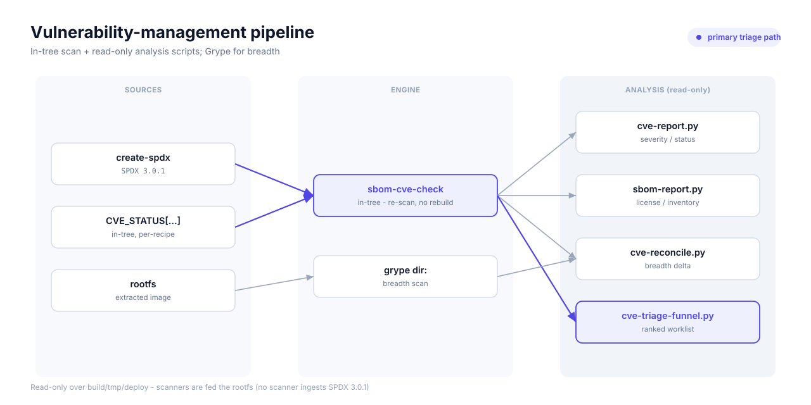
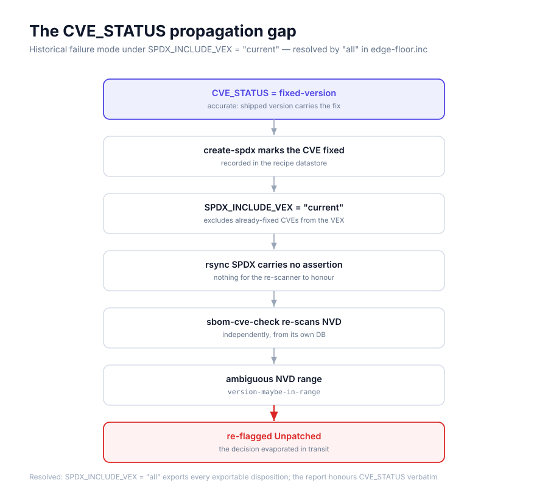

# Vulnerability-management architecture

Decision record for the CRA vulnerability-management workstream on this
distro (Yocto wrynose 6.0, smarc-rzv2l). It states the decisions in force,
the measured baseline they rest on, and the questions still open. Vulnerability
handling here maps to CRA Annex I §2 (no known exploitable vulnerabilities) and
the Part II vulnerability-handling requirements; the draft horizontal standard
for the latter is prEN 40000-1-3. [`CRA-CONTROLS.md`](CRA-CONTROLS.md) holds the
requirements view.

Companions: [`cve-triage.md`](cve-triage.md) (the CVE workflow and
disposition policy), [`vex-and-cve-status.md`](vex-and-cve-status.md) (what
dispositions assert publicly via VEX), [`sbom-analysis.md`](sbom-analysis.md)
(the SBOM workflow), and
[`foss-cra-tooling-survey.md`](foss-cra-tooling-survey.md) (the tooling
landscape the stack is drawn from).

## Pipeline



- **In-tree CVE engine:** `sbom-cve-check`, the CVE tool in wrynose oe-core,
  wired in the edge distro. It re-scans without a full rebuild and consumes
  `CVE_STATUS` / VEX.
- **SBOM:** SPDX 3.0.1 via `create-spdx`. No production scanner ingests SPDX
  3.0.1, so scanners are fed the extracted **rootfs**, not the SBOM.
- **Breadth scanner:** Grype (`dir:` over the extracted rootfs) — the only
  third-party scanner in use.
- **Analysis scripts** (stdlib-only, read-only over `build/tmp/deploy`):
  `cve-report.py`, `sbom-report.py`, `cve-reconcile.py`, `cve-triage-funnel.py`.
  Scanner pins live in `install-scanners.sh` (binaries gitignored under
  `.tooling/`).
- **Remediation proposal tooling:**
  [yocto-security-tools](https://github.com/Ericsson/yocto-security-tools)
  (Ericsson, FOSS — extractor / corrector / cve-agent) generates candidate
  backports and
  dispositions from distro security patch series. Proposal layer only:
  everything it produces is gated by per-claim review before landing (D4).

## Decisions

The workstream rests on seven principles. Each states *what* it guarantees for a
reviewer first, then how it is implemented.

### D1 — Triage collapses a scary count into a human-sized worklist
The raw report lists hundreds of "Unpatched" CVEs; the large majority are NVD
CPE over-matching (an open-ended version range, a same-named but different
codebase, one CVE counted once per sub-package), not real exposure.
`cve-triage-funnel.py` sets the kernel aside, collapses the duplicate matches of
a single CVE across related packages, auto-*proposes* a disposition only where
the fix data is unambiguous, and escalates the rest — each item pre-loaded with
the evidence a reviewer needs: which package actually holds the code, the CVSS
vector, the known fix, and the checks to run on the device. The output is a
short list of genuine judgment calls, not a wall of noise.

### D2 — Every suppression is recorded in version control and is auditable
A decision that a CVE does not apply lives in the tree as a `CVE_STATUS`
annotation — committed to git, reviewed like code, surviving staff turnover —
not in a scanner's private exception list. A recipe-specific decision sits in
that recipe; a decision that applies to a whole upstream family (one CVE that
matches many related packages at once, because they share a vulnerability
identity) sits in a single shared file. That shared file is designed but not
yet created (OQ-3).

### D3 — A decision states the truth, not a number that looks better
The status chosen is the accurate one, even when it does not lower the count. A
component that already carries the upstream fix is marked `fixed-version` —
a principle that held even while, under the since-resolved propagation gap
(historical section below), the report did not reflect that status. A
status is never swapped for a different, tool-honoured value just to make a
finding disappear — that would put a false statement into the audit record the
CRA vulnerability-handling process depends on.

### D4 — No unreviewed automated suppression lands
Tools may propose dispositions, and some can technically write `CVE_STATUS`
lines into the tree — so the control is not "no tool writes", it is that no
machine-authored suppression *lands* without per-claim human review: the
affected-version claim checked against the upstream advisory, the
vulnerable-code claim checked against the shipped source or binary,
independent of the tool that produced it. This is not hypothetical: the
yocto-security-tools corrector once wrote three `not-applicable-config`
entries whose introduced-in-version claim contradicted the upstream
advisories; all three were caught and reverted only by that review. Any proposal derived from
build metadata alone is `UNVERIFIED`, because reachability — is the service
running, is the port open, is SELinux enforcing — is a fact about the
running device, not the build. Suppression is a security assertion and
carries an owner.

### D5 — A second, independent scanner covers the primary's blind spot
`sbom-cve-check` matches vulnerabilities by recipe, so it cannot see flaws
inside vendored third-party dependencies — for example the Go modules bundled
inside the container tooling. Grype, run over the built filesystem, finds those.
Grype is the only third-party scanner in use; OSV-Scanner and others are
surveyed options, not wired in. Full reliance on Grype is gated on OQ-2.

### D6 — The kernel is triaged separately, by a different method
Kernel CVEs dominate the count and cannot be cleared by version comparison; the
question that matters is whether the affected subsystem is even compiled into
this kernel's configuration. That is a distinct effort (OQ-5, now measured in
[`kernel-cve-triage.md`](kernel-cve-triage.md)), so the kernel is parked as a
single line rather than diluting the userland worklist.

### D7 — Reproducible scanner inputs; independent disposition evidence
Two different evidence roles, not to be conflated. *Scan reproduction* uses
the CVE databases pinned into the build, not live NVD: the pinned database
reproduces the exact finding under triage, so a delta between two reports is
attributable to layer changes rather than feed drift. These databases often
give only discrete affected versions with no clean fix boundary, which is
why many cases cannot be cleared automatically and are escalated instead.
*Disposition verification* deliberately goes outside that loop: a claim that
a CVE does not apply is checked against primary upstream sources — the
project's advisory, the fix commit, the shipped source or binary — never
against the pinned database or the scanner that produced the finding, which
share the blind spots the disposition is meant to correct.

## The CVE_STATUS propagation gap (historical — resolved by `SPDX_INCLUDE_VEX = "all"`)

> **Status: resolved.** The gap below existed under the oe-core default
> `SPDX_INCLUDE_VEX = "current"`. This distro now sets
> `SPDX_INCLUDE_VEX = "all"` in
> `meta-edge-distro/conf/distro/include/edge-floor.inc`, which exports every
> exportable disposition (`unknown` is skipped); a differential rescan
> (2026-08-13) confirmed the report
> honours recipe `CVE_STATUS` verbatim (47 previously-lost rows moved to
> their dispositioned status — 43 expected, 4 discovered in the delta —
> each transition classified). The section is
> kept as the record of the failure mode and of why `"all"` is load-bearing
> — reverting it silently reopens the gap. VEX-export semantics are
> documented in [`vex-and-cve-status.md`](vex-and-cve-status.md).

Under `SPDX_INCLUDE_VEX="current"` (the default), a
`CVE_STATUS = "fixed-version"` decision was invisible to the
`sbom-cve-check` report: `current` excludes already-fixed CVEs from the
emitted VEX, so `sbom-cve-check` re-scans and sees no assertion, re-deriving
the finding from NVD — often ambiguous, so it stays Unpatched. The accurate
status therefore did not reduce the report count.

Worked example — CVE-2024-12084 (rsync, CVSS 9.8): a heap overflow in the rsync
daemon, fixed upstream in 3.4.0. The image builds rsync 3.4.1, which carries the
fix; on the target, 3.4.1 is installed, no `rsync`/`rsyncd` unit exists, and
nothing is bound to TCP/873. The accurate decision was:

```bitbake
CVE_STATUS[CVE-2024-12084] = "fixed-version: fixed upstream in rsync 3.4.0, recipe builds 3.4.1"
```

The flag resolved in rsync's datastore, yet after regenerating the SBOM the CVE
stayed Unpatched / `version-maybe-in-range`:



The tool derived "Patched" from its own version comparison, never from a
`fixed-version` VEX, so the decision evaporated in transit. The not-affected
family (`not-applicable-config` etc.) stayed in the "current" VEX as
`VexNotAffected` and was honoured — which is why inherited suppressions showed
up while this one did not. (The shipped disposition for CVE-2024-12084 was
later recorded as `cpe-incorrect` — the DB range, not the shipped code, is
what is wrong — and is honoured under `"all"`.)

Two distinct gap classes, not to be conflated:

| | Vocabulary gap | Propagation gap (this) |
|---|---|---|
| What | No VEX justification exists for the status | Status maps cleanly but does not survive transit |
| Cases | `disputed`, `cpe-incorrect` | `fixed-version` under `SPDX_INCLUDE_VEX=current` |
| Fix locus | OpenVEX / CSAF spec extension (upstream) | Pipeline wiring (emit `VexFixed`, or consume VEX downstream) |

A third, distinct defect class is **semantic mapping**: `upstream-wontfix`
describes an applicable vulnerability upstream declines to fix, yet Yocto
exports every Ignored status — this keyword included — as a `doesNotAffect`
VEX relationship, converting "won't be fixed" into "not affected". The fix
locus is the oe-core status map; the local control is the authoring
prohibition ([`cve-triage.md`](cve-triage.md) rule 6: never hand-authored
for applicable code) plus the audit of inherited entries (OQ-8).

With `"all"` in force, the `sbom-cve-check` report itself honours every
exportable disposition (`unknown` is skipped), so in-report suppression no
longer depends on the OpenVEX →
`grype --vex` path. That path remains relevant for the breadth scanner:
aligning Grype's independent findings with the in-tree decisions is still
designed, not yet demonstrated (OQ-6).

## 📊 Measured baseline (snapshot 2026-06-23)

> ⚠️ **Snapshot — `edge-image-dev`, build `20260623172940`, _before any
> triage_.** Every count in this section is bound to that dated build and its
> pinned CVE databases; none is a current number. These are the *starting*
> figures, not the residual exposure — later campaign reports carry their own
> dated measurements; re-run the scripts against the current build to refresh.

**CVE report** (`cve-report.py`) — 17,943 CVEs evaluated:

| | Status | Count |
|---|---|---|
| ✅ | Patched | 16,575 |
| 🟡 | Ignored | 896 — mostly inherited from upstream layers (OQ-8) |
| 🔴 | **Unpatched** | **472** — 387 kernel / 85 userland |

Severity across all 472 Unpatched: **1 critical**, 79 high, 181 medium, 25 low,
186 unscored.

> **Superseded (kernel).** The **387** kernel figure is the pre-bump baseline
> (`linux-renesas 6.12.43-cip7`). The HW-validated cip7 → cip14 kernel bump clears
> **153** of them (net −148 → **239** kernel Unpatched, 0 CRITICAL) — see
> [`kernel-cve-bump-cip14.md`](kernel-cve-bump-cip14.md). The numbers in this
> measured-baseline snapshot are otherwise left as recorded.

**Triage funnel** (`cve-triage-funnel.py`) — 📉 **472 raw → 43 userland
decision-units**. The kernel (387) is set aside; duplicate matches of one CVE
collapse (42 absorbed). Of the 43, one is auto-proposed and 42 escalate to the
human worklist.

**Cross-scanner breadth** (`cve-reconcile.py`, Grype over the rootfs) — 🔍 **50
CVEs Grype flags that `sbom-cve-check` never evaluated, 0 overlap** — every one
inside vendored Go dependencies (`golang.org/x/crypto` incl. criticals,
`docker`, `buildkit`, `grpc`) that recipe-based scanning cannot see. This run
had Grype's OS-package matchers disabled by distro detection (`ID=edge-ai`), so
it covers only the language layer (OQ-2).

**SBOM** (`sbom-report.py`) — 📦 484 recipes · 1,101 installed packages · 2,112
fetched source artifacts (**100% carry a download URL**) · 223 licenses; 5 built
packages without a declared license. (Built packages have no download URL *by
design* — SPDX 3.0 puts the URL on the `source`-purpose node, not the built one.)

## Open questions

These are decisions and wiring not yet done. The work so far has been
measurement and tool verification, which sharpens each question but does not
close it — where a single concrete action would close one, it is named.

- **OQ-1 — SELinux posture (enforcing vs permissive).** The image ships
  `SELINUX=permissive`; moving to enforcing is an operator decision that gates
  the reachability of SELinux-enforcement CVEs. *Now settled:* a posture gate is
  a flag to investigate, not a verdict — a gated CVE can resolve
  posture-independently (CVE-2016-7545 is `fixed-version`, the shipped userspace
  carries the fix, regardless of posture). The enforcing decision itself is open.
- **OQ-2 — Grype OS-package parity.** The measured run covered only the language
  layer because distro detection failed on `ID=edge-ai`, disabling the
  OS-package matchers. *Closes with:* a `grype --distro` re-run to establish
  OS-package behaviour before relying fully on Grype (D5).
- **OQ-3 — the distro-wide suppression file.** The shared `CVE_STATUS` locus
  (D2) is designed but does not exist; creating and wiring it is a build-config
  change. Until then, family-wide decisions have nowhere to live.
- **OQ-4 — VEX completeness (`SPDX_INCLUDE_VEX` `current` vs `all`).**
  *Closed.* `all` is set in `edge-floor.inc` and verified by differential
  rescan (2026-08-13): the report honours `fixed-version` and every other
  exportable disposition verbatim (`unknown` is skipped); 47 previously-dropped
  rows moved to their
  dispositioned status (43 expected + 4 discovered in the delta). See §"The CVE_STATUS propagation gap" (historical)
  and [`vex-and-cve-status.md`](vex-and-cve-status.md).
- **OQ-5 — kernel config-reachability.** *Phase 0 measured* — the config-
  reachability instrument (oe-core `improve_kernel_cve_report.py`) has been run
  read-only and its validation gate passed; see
  [`kernel-cve-triage.md`](kernel-cve-triage.md). The compiled-files filter moves
  only 6 of the 387 with evidence (381 remain Unpatched); its value is the
  evidence attached to the survivors, not a count reduction. *Complementary lever
  landed:* the HW-validated cip7 → cip14 kernel bump clears 153 of the survivors
  (net −148), the count-moving half of the strategy —
  [`kernel-cve-bump-cip14.md`](kernel-cve-bump-cip14.md). *Open:* transcribing
  ratified dispositions into `cve-exclusion-renesas-6.12.inc`, and the separate
  coverage of Renesas out-of-tree code the mainline CNA cannot see.
- **OQ-6 — end-to-end VEX suppression.** Grype's `--vex` consumption is
  *confirmed to work* (it moves not-affected/fixed findings to ignored). Wiring
  the Yocto VEX export through to it and measuring the suppressed result is not
  yet done.
- **OQ-7 — funnel convergence.** The funnel does not yet read already-recorded
  `CVE_STATUS`, so ratified CVEs re-surface in the worklist. Adding that pass is
  what makes the worklist shrink as decisions accrue.
- **OQ-8 — inherited suppressions.** Most Ignored CVEs (the 896 above) are
  inherited from upstream layers, not decided here — yet each ships as a
  product `doesNotAffect` assertion in the exported VEX. They therefore
  require auditing and affirming as this distro's posture; "trust as-is" is
  not an option under the disposition policy. Until that audit completes,
  they are identified as inherited/unratified rather than passed off as
  ratified decisions.

## Out of scope

Format-conversion strategy, dashboard choice, and the commercial-vs-FOSS
intelligence comparison live in the tooling survey. Nothing here mandates a tool
the workstream has not adopted.
